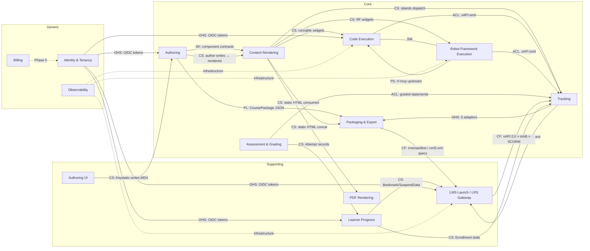

# 02 — Bounded Context Map

Relationships between contexts using classic DDD patterns: **Shared Kernel (SK)**, **Customer-Supplier (CS)**, **Conformist (CF)**, **Anti-Corruption Layer (ACL)**, **Open Host Service (OHS)**, **Published Language (PL)**, **Separate Ways (SW)**, **Partnership (PS)**.

Cited sections refer to [`compass_artifact_...md`](../research/compass_artifact_wf-292dc733-175b-4d9e-b108-ac3492a7a5db_text_markdown.md).

## 1. Map diagram

## 2. Per-context summaries

### 2.1 Authoring (Core)

- **Purpose** — accept MDX + frontmatter + content collections as the source of truth; validate; emit a lossless build-time JSON manifest (Research §2, §6).
- **Core language** — Course, Module, Lesson, Section, Frontmatter, Component, Challenge, Scenario, QuestionBank.
- **Key capabilities** — Zod frontmatter schemas, component-registry enforcement, build-time validation, unified manifest emission.
- **Upstream** — Identity & Tenancy (for multi-tenant workspace scoping), Authoring UI (Keystatic writes MDX back in).
- **Downstream** — Content Rendering, Packaging & Export, PDF Rendering.
- **Integration style** — **Published Language** (the unified JSON manifest is the stable authored contract consumed by every downstream packager). **Shared Kernel** with Content Rendering for the Component contract set.

### 2.2 Content Rendering (Supporting)

- **Purpose** — turn MDX + island widgets into static HTML plus hydrated React islands; minimize JS bundle per page (Research §2.2).
- **Core language** — Island, StaticHtml, Hydration, PrintFallback, PrerenderedSvg, Snapshot.
- **Key capabilities** — Astro static build, Shiki highlighting via Expressive Code, Mermaid pre-render, Pagefind search.
- **Upstream** — Authoring.
- **Downstream** — Packaging & Export (static `dist/`), PDF Rendering (concatenated HTML), Tracking (islands dispatch Tracker calls at runtime), Code Execution & Robot Framework Execution (runnable widgets emit ExecutionRequests).
- **Integration style** — **Customer-Supplier** to Authoring; **Shared Kernel** for the Component contract.

### 2.3 Code Execution (Core)

- **Purpose** — execute learner code safely and stream results, in two modes: in-browser Pyodide/Sandpack, and server-side FastAPI + Docker + gVisor (Research §4.1–§4.3).
- **Core language** — ExecutionRequest, Sandbox, Runner, WarmPool, ResourceLimits, SeccompProfile, StreamChunk, Grader.
- **Key capabilities** — warm-pool Runner orchestration, per-user quotas, SSE/WebSocket streaming, grading harness.
- **Upstream** — Identity & Tenancy (quota check), Content Rendering (requests arrive from widgets), Observability.
- **Downstream** — Tracking (emits `executed-code`, `passed`, `failed`), Assessment & Grading (via test harness).
- **Integration style** — **ACL** to Tracking (wraps ExecutionResults as xAPI statements). **Separate Ways** from Robot Framework Execution so the two runners evolve independently (even though they share a container base image).

### 2.4 Robot Framework Execution (Core)

- **Purpose** — execute Robot Framework Suites in two operational modes (batch grading via `robot` CLI; tutorial / guided via `rf-mcp` MCP server) (Research §4.4).
- **Core language** — Suite, Test, Keyword, ExecutionContext, ToolProfile, OutputXml, LogHtml.
- **Key capabilities** — `output.xml` parsing, log.html embedding in isolated origin, learning-specific rf-mcp tool profile.
- **Upstream** — Identity & Tenancy, Content Rendering, Observability.
- **Downstream** — Tracking, Assessment & Grading, LMS Launch (via log.html iframe).
- **Integration style** — **Partnership** with rf-mcp (Many owns both projects — upstream `learning_exec` profile is a planned contribution). **Separate Ways** from Code Execution despite sharing infra.

### 2.5 Assessment & Grading (Core)

- **Purpose** — grade Quiz responses and Challenge submissions; produce Score and Feedback; attach to an Attempt (Research §6.5, §6.6).
- **Core language** — Attempt, Score, Feedback, PassingScore, HiddenTest, ReviewMode.
- **Key capabilities** — test harness, scored-question evaluation, hint-cost-degradation scoring.
- **Upstream** — Code Execution, Robot Framework Execution.
- **Downstream** — Tracking, Learner Progress.
- **Integration style** — **ACL** to Tracking.

### 2.6 Packaging & Export (Core)

- **Purpose** — produce five CoursePackage artifacts from one build output — `scorm12`, `scorm2004-4th`, `cmi5`, `xapi`, `plain` — plus PDF (Research §3.5).
- **Core language** — CoursePackage, PackageKind, Manifest, ImsManifest, Cmi5Xml, ZipLayout.
- **Key capabilities** — Nunjucks manifest templating, zip invariant enforcement (no `__MACOSX/`, manifest-at-root), AssetRewrite, `suspend_data` cap enforcement.
- **Upstream** — Authoring (CoursePackage VO), Content Rendering (dist/), Tracking (bundles the right Adapter).
- **Downstream** — LMS Launch, PDF Rendering (PDF export).
- **Integration style** — **Conformist** to SCORM 1.2, SCORM 2004 4th, cmi5 (we comply with the spec — we don't shape it). **Published Language consumer** of Authoring's manifest.

### 2.7 Tracking (Core)

- **Purpose** — unified domain facade for progress/score/completion regardless of output format. Owns the `Tracker` interface and five Adapters (Research §3.5, §4.5).
- **Core language** — Tracker, Adapter, Statement, Verb, Actor, Activity, Registration (cmi5), Enrollment, LessonStatus, SuspendData, Bookmark.
- **Key capabilities** — single façade for `init / setProgress / setBookmark / recordInteraction / setScore / complete / pass / fail / terminate`; per-output adapter bundling at build time.
- **Upstream** — Code Execution, RF Execution, Assessment, Content Rendering.
- **Downstream** — LMS Launch / LRS Gateway, Packaging (adapter selection), Learner Progress.
- **Integration style** — **Open Host Service** to every emitter (one Tracker interface, N adapters). **ACL** on the outbound side (translates to SCORM / cmi5 / xAPI dialects).

### 2.8 Learner Progress (Supporting)

- **Purpose** — server-side store of Enrollment, Attempt, Bookmark, and SuspendData mirror so learners can resume across devices (Research §8 Phase 2).
- **Core language** — Enrollment, Attempt, Bookmark, Resume, Score.
- **Key capabilities** — CRUD API backing FastAPI `/progress`; reconciliation with LMS-held state.
- **Upstream** — Identity & Tenancy, Assessment & Grading, Tracking.
- **Downstream** — LMS Launch (for cross-device resume), Rendering (hydrates Bookmark into `<Resume>` widget).
- **Integration style** — **Customer-Supplier** to Tracking for Bookmark/SuspendData.

### 2.9 Authoring UI (Supporting)

- **Purpose** — optional web UI (Keystatic; Sveltia fallback) for non-developer authors to edit MDX via typed schemas (Research §2.3).
- **Core language** — shares Authoring's language; adds "Editor", "SchemaPreview".
- **Key capabilities** — schema-driven forms, GitHub PR or local-filesystem persistence.
- **Upstream** — Identity & Tenancy.
- **Downstream** — Authoring (writes MDX files).
- **Integration style** — **Customer-Supplier** upstream of Authoring; **Shared Kernel** on component schemas.

### 2.10 PDF Rendering (Supporting)

- **Purpose** — produce book-quality PDF via Paged.js + Playwright-driven headless Chromium (Research §5).
- **Core language** — PrintFallback, PrerenderedSvg, Snapshot, QrCallback.
- **Key capabilities** — `@page`, `string-set`, `target-counter`, Mermaid pre-render, `?print=1` island snapshots with QR callback.
- **Upstream** — Content Rendering.
- **Downstream** — Packaging (PDF as one export alongside the zips).
- **Integration style** — **Customer-Supplier** to Content Rendering.

### 2.11 LMS Launch / LRS Gateway (Supporting)

- **Purpose** — handle cmi5 launch parameters, proxy xAPI Statements to the LRS (so browsers never hold LRS credentials), enforce SCORM API contract at runtime (Research §4.5, §7).
- **Core language** — Launch, Registration, ReturnURL, Statement, LRS, Actor.
- **Key capabilities** — cmi5 launch handshake (`fetch` AU parameters + auth token), xAPI proxy with Statement validation, SCORM API stub wiring to `scorm-again`.
- **Upstream** — Identity & Tenancy, Tracking.
- **Downstream** — external LRS (Yet Analytics SQL LRS), external LMS.
- **Integration style** — **Conformist** to xAPI 2.0, cmi5, SCORM specs. **ACL** inbound (normalizes LMS quirks before they reach Tracking).

### 2.12 Identity & Tenancy (Generic)

- **Purpose** — OIDC SSO, multi-tenant isolation, roles, permissions (Research §8 Phase 5).
- **Core language** — Tenant, Workspace, Organization, Role, Permission, Identity, Subject.
- **Integration style** — **Open Host Service** exposing OIDC tokens consumed by every other context.

### 2.13 Observability (Generic)

- **Purpose** — OTel traces, Loki logs, Tempo spans, Sentry errors (Research §7).
- **Integration style** — ambient infrastructure; cuts across every context.

### 2.14 Billing (Generic)

- **Purpose** — Stripe integration for paid tiers (Research §8 Phase 5).
- **Integration style** — plugs into Identity & Tenancy only. Deferred to Phase 5; modeled as a skeleton context.

## 3. Context-by-context relationship matrix

Rows are *upstream producers*; columns are *downstream consumers*. Cell entries are the integration pattern between them. Empty cells have no direct relationship.

|                      | Auth | Render | Code | RF   | Assess | Pkg  | Track | Prog | UI   | PDF  | LMS  | IAM  | Obs  |
|----------------------|------|--------|------|------|--------|------|-------|------|------|------|------|------|------|
| **Authoring**        | —    | SK+CS  |      |      |        | PL   |       |      |      |      |      |      |      |
| **Content Render**   |      | —      | CS   | CS   |        | CS   | CS    |      |      | CS   |      |      |      |
| **Code Exec**        |      |        | —    | SW   | CS     |      | ACL   |      |      |      |      |      |      |
| **RF Exec**          |      |        | SW   | —    | CS     |      | ACL   |      |      |      | CS   |      |      |
| **Assessment**       |      |        |      |      | —      |      | ACL   | CS   |      |      |      |      |      |
| **Packaging**        |      |        |      |      |        | —    |       |      |      |      | CF   |      |      |
| **Tracking**         |      |        |      |      |        | OHS  | —     | CS   |      |      | ACL  |      |      |
| **Learner Progress** |      |        |      |      |        |      | CS    | —    |      |      | CS   |      |      |
| **Authoring UI**     | CS   |        |      |      |        |      |       |      | —    |      |      |      |      |
| **PDF Rendering**    |      |        |      |      |        | CS   |       |      |      | —    |      |      |      |
| **LMS Launch**       |      |        |      |      |        |      | CF    |      |      |      | —    |      |      |
| **IAM**              | OHS  | OHS    | OHS  | OHS  | OHS    | OHS  | OHS   | OHS  | OHS  |      | OHS  | —    |      |
| **Observability**    | inst | inst   | inst | inst | inst   | inst | inst  | inst | inst | inst | inst | inst | —    |
| **rf-mcp (ext)**     |      |        |      | PS   |        |      |       |      |      |      |      |      |      |

Legend:

- **PL** — Published Language (stable, versioned, documented contract).
- **SK** — Shared Kernel (two contexts co-own a small shared model; change requires coordination).
- **CS** — Customer-Supplier (one context's upstream; changes flow downstream, downstream has veto).
- **CF** — Conformist (downstream must adopt upstream's model without modification; SCORM / cmi5 / xAPI specs).
- **ACL** — Anti-Corruption Layer (deep translation prevents model pollution).
- **OHS** — Open Host Service (well-defined protocol consumable by many).
- **SW** — Separate Ways (explicit decoupling — no direct integration even though both could plausibly share).
- **PS** — Partnership (two teams / projects co-evolve; upstream contributions planned).
- **inst** — Ambient instrumentation (Observability).

## 4. Boundary rationales worth stating explicitly

1. **Code Execution vs Robot Framework Execution are Separate Ways** — both share the gVisor sandboxing pattern and could plausibly live in one context, but RF Execution has a second fundamentally different mode (live `rf-mcp` ExecutionContext) that would pollute the clean ExecutionRequest/ExecutionResult model of Code Execution. Keeping them as siblings lets each evolve its own lifecycle (Research §4.3 vs §4.4).

2. **Tracking is not Packaging even though Adapter selection happens at build time.** Tracking owns the Adapter abstraction; Packaging is a *consumer* that asks Tracking "give me the SCORM 1.2 adapter bundled into this zip." If we collapsed them, the `Tracker` runtime interface would drift toward Packaging's needs (zip layout, manifest generation) and the clean `setScore(0.9)` component-facing API would rot.

3. **Assessment is not Code Execution.** Grading is a strictly authored concept (what counts as correct) independent of *how* the code ran. The Grader aggregate in Code Execution is *purely* the test-running orchestration; the **authoritative correctness judgment** lives in Assessment as a Challenge invariant (e.g. "PassingScore ≥ 0.7 AND all HiddenTests pass"). Keeping this split lets us grade rubric-only quizzes that never touch Code Execution.

4. **LMS Launch is Conformist, not ACL-out.** We conform to cmi5 and SCORM specs wholesale (no in-house dialect). The ACL runs *inbound* — normalizing LMS quirks (Cornerstone dropping interactions, TalentLMS being 1.2-only per Research §3.3) into the clean internal Tracking model. The *outbound* translation from Tracking → spec lives in Tracking's Adapter.

5. **Authoring UI is a separate context, not part of Authoring.** Keystatic's own release cadence and schema API (Research §2.3) mean it evolves at a different pace. Modeling it as Customer-Supplier upstream of Authoring keeps MDX as the canonical persistence layer — whether the author typed it by hand or Keystatic wrote it.

6. **Identity & Tenancy is Generic, not Core.** OIDC is a commodity. We buy, we don't build. Core teams should not spend novelty budget here. The context still exists because every other context consumes its language (Tenant, Role, Subject) (Research §8 Phase 5).

See [`03-context-models/`](./03-context-models/) for each context's internal model and [`05-anti-corruption-layers.md`](./05-anti-corruption-layers.md) for the ACL designs that make these boundaries safe.
