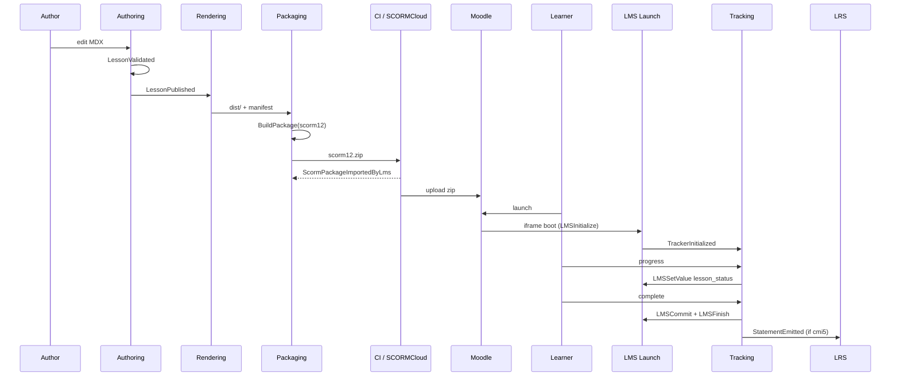
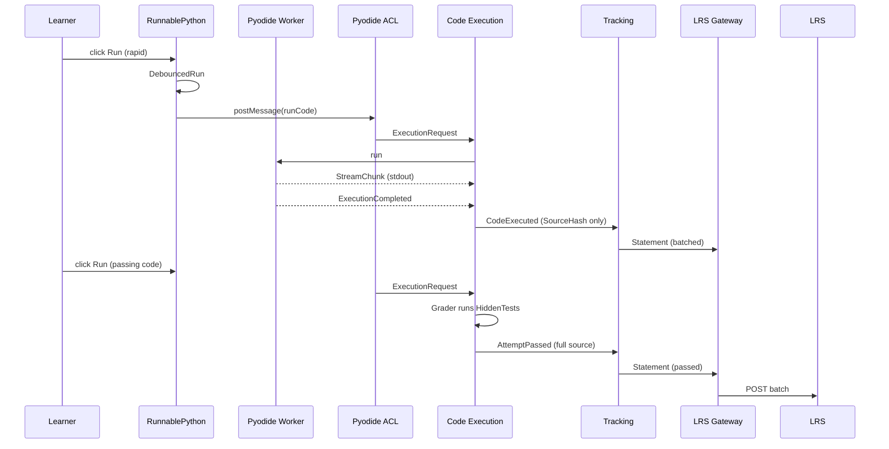
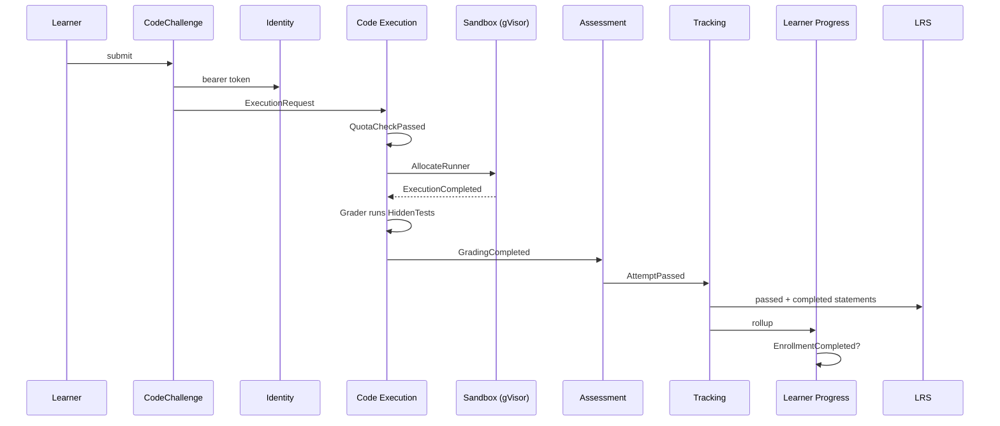
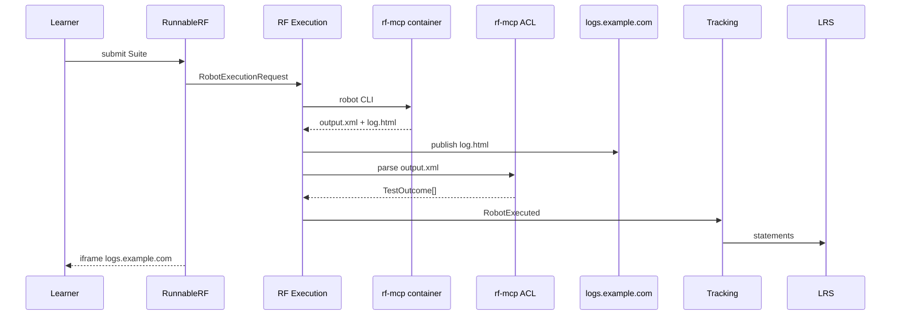
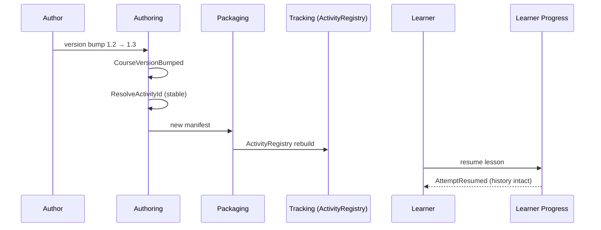
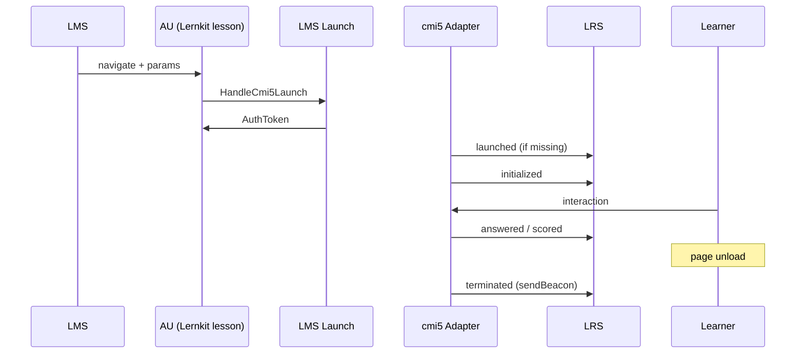

# 04 — Domain Events and End-to-End Flows

Six canonical scenarios, each as a numbered sequence plus a Mermaid sequence diagram. Events are `backticks` and past-tense. Citations "§N" refer to [`compass_artifact_...md`](../research/compass_artifact_wf-292dc733-175b-4d9e-b108-ac3492a7a5db_text_markdown.md). Contexts below are linked to their [context model](./03-context-models/).

---

## Flow 1 — Author writes MDX → SCORM 1.2 → Moodle → learner completes → xAPI recorded

End-to-end happy path covering Authoring → Packaging → LMS Launch → Tracking → LRS.

### Steps

1. Author edits `src/content/courses/py101/loops.mdx` (directly, or via [Authoring UI](./03-context-models/authoring-ui.md)); `EditorSessionOpened` → `DraftSaved`.
2. CI runs `pnpm build`; [Authoring](./03-context-models/authoring.md) emits `LessonValidated` → `LessonPublished` for every lesson.
3. [Content Rendering](./03-context-models/content-rendering.md) emits `PageRendered` × N; diagrams become `PrerenderedSvg`.
4. [Packaging](./03-context-models/packaging.md) runs `BuildPackage(scorm12)`; `ManifestRendered` → `AssetsRewritten` → `ZipAssembled` → `PackageBuilt`.
5. CI uploads zip to SCORM Cloud (§3.3 operational rule); success yields `ScormPackageImportedByLms` (CI event).
6. Admin uploads the same zip to Moodle; Moodle imports cleanly (thanks to invariant: `imsmanifest.xml` at root, no `__MACOSX/`).
7. Learner clicks launch; Moodle opens the package in an iframe. [LMS Launch](./03-context-models/lms-launch.md) wires the SCORM 1.2 API via `scorm-again`: `LaunchInitiated`.
8. Launched lesson JS calls `tracker.init()`; [Tracking](./03-context-models/tracking.md) emits `TrackerInitialized` bound to the `ScormAgainAdapter12`.
9. Learner progresses; `<Progress>` island drives `tracker.setProgress(0.4)`; `ProgressUpdated` → Adapter writes `cmi.core.lesson_status = incomplete` + `cmi.core.lesson_location`.
10. Learner finishes; `tracker.complete()` → `Completed` → Adapter writes `cmi.core.lesson_status = completed` + `LMSCommit`.
11. `Terminated` fires on unload; `LMSFinish`.
12. Parallel path: the same build shipped a cmi5 variant; an xAPI `StatementEmitted` mirror is also sent via [LMS Launch](./03-context-models/lms-launch.md)'s StatementProxy when the launch happened through cmi5.

### Diagram

---

## Flow 2 — Pyodide `<RunnablePython>` run → debounced → SourceHash-only until pass → full source on pass

Demonstrates the storage-bounding rule (§4.5).

### Steps

1. Learner types code in `<RunnablePython>` and clicks Run. The Island emits a `DebouncedRun` key; rapid-click coalescing prevents multiple submissions.
2. The Island sends a domain-shape `ExecutionRequest` via the [Pyodide ACL](./05-anti-corruption-layers.md#4-pyodide-acl) (worker-postMessage → `ExecutionRequest`/`StreamChunk`).
3. Pyodide Worker runs the code; `StreamChunkEmitted` fires repeatedly as stdout arrives.
4. Terminal `ExecutionCompleted` arrives with an `ExecutionResult`.
5. [Code Execution](./03-context-models/code-execution.md) emits `CodeExecuted` **carrying only `SourceHash`**, not the source.
6. The [xAPI Statement ACL](./05-anti-corruption-layers.md#5-xapi-statement-acl) wraps it as an `executed-code` xAPI statement → `StatementEmitted` → batched.
7. [Assessment](./03-context-models/assessment.md) checks: no HiddenTest ran (this is a raw run, not a graded submission), so no Attempt event fires.
8. Later, learner reruns with code that passes; Grader fires, `AttemptPassed` carries **full source** (terminal event).
9. [LMS Launch](./03-context-models/lms-launch.md) StatementProxy flushes the batch to the LRS; rejected statements are logged.

### Diagram

---

## Flow 3 — `<CodeChallenge>` submission → server runner → grade → xAPI → cmi5 completed+passed

Demonstrates the server-runner path and the cmi5 moveOn rule.

### Steps

1. Learner submits a Challenge; the Island emits an `ExecutionRequest` targeting the server runner (not Pyodide — because the harness has hidden tests outside the browser's reach).
2. [Identity & Tenancy](./03-context-models/identity-tenancy.md) asserts the subject; [Code Execution](./03-context-models/code-execution.md) runs `QuotaCheckPassed`; `SandboxAllocated`; `ExecutionStarted`.
3. Sandbox executes with `--runtime=runsc --network=none --read-only` (§4.3) and wall-clock Timeout enforced outside.
4. `ExecutionCompleted` → Grader runs HiddenTests → `GradingCompleted` with `TestOutcome[]`.
5. [Assessment](./03-context-models/assessment.md) computes Score with HintUsage degradation → `AttemptGraded` → `AttemptPassed`.
6. [Tracking](./03-context-models/tracking.md) emits `Passed`, dispatches through `Cmi5Adapter` to:
    - `StatementEmitted` verb=`passed` with scaled Score + per-test breakdown extension
    - if mastery threshold reached: also `Completed` (emits verb=`completed`)
7. cmi5 `MoveOn = CompletedAndPassed` is satisfied; AU is marked done in the LMS.
8. [Learner Progress](./03-context-models/learner-progress.md) rolls up `AttemptRolledUp`; Enrollment may fire `EnrollmentCompleted`.

### Diagram

---

## Flow 4 — `<RunnableRF>` → rf-mcp batch → output.xml parsed → log.html iframe on isolated origin

Demonstrates the Robot Framework path and the log.html security isolation (§4.4).

### Steps

1. Learner submits an RF Suite via `<RunnableRF>`. The Island emits a domain `RobotExecutionRequest` (the [rf-mcp ACL](./05-anti-corruption-layers.md#3-rf-mcp-acl) translates later).
2. [Robot Framework Execution](./03-context-models/robot-framework-execution.md) routes to batch mode; spawns an `rf-mcp:latest` container under gVisor with the non-browser ToolProfile.
3. `SuiteSubmitted` → `RobotRunStarted`; `robot` CLI produces `output.xml`, `log.html`, `report.html`.
4. The ACL calls `ParseOutputXml` → `OutputXmlParsed` → `TestOutcome[]` + `RobotRunCompleted`.
5. `log.html` is published to `logs.example.com` (isolated origin, strict CSP); `LogHtmlPublished`.
6. Streaming is synchronous WebSocket: each `KeywordExecuted` event hits the Island during the run for live progress display.
7. ACL translates result into `RobotExecuted` xAPI statement; [Tracking](./03-context-models/tracking.md) → LRS.
8. The Island iframes `logs.example.com/<runId>/log.html` with `sandbox="allow-same-origin"` only — the main app's security context is protected.
9. If graded, [Assessment](./03-context-models/assessment.md) consumes TestOutcomes analogous to Flow 3.

### Diagram

---

## Flow 5 — Author publishes course v1.3 → versioned xAPI ActivityIds stay stable (or are bumped deliberately)

Demonstrates Research §3.2: changing `ActivityId` fragments history.

### Steps

1. Author bumps `Course.version` to `1.3`; `CourseVersionBumped` fires.
2. [Authoring](./03-context-models/authoring.md) runs `ResolveActivityId` — since `ActivityId` is derived from `(CourseId, LessonId)` (NOT from version), existing lesson IRIs are preserved; learner history does not fragment.
3. If the author *also* changed a `LessonId` (restructure), that lesson gets a new IRI — an intentional history break.
4. [Packaging](./03-context-models/packaging.md) emits `PackageBuilt` with the updated `imsmanifest.xml` version field.
5. [Tracking](./03-context-models/tracking.md)'s `ActivityRegistry` is rebuilt from the manifest; emits the same IRIs on the wire.
6. Post-deploy, a learner already mid-course resumes. Their `Registration` (cmi5) is scoped to the old AU ID (which hasn't changed). [Learner Progress](./03-context-models/learner-progress.md) matches by IRI; `AttemptResumed`.
7. Had the IRI been unintentionally changed, the learner would appear to have never started the lesson — this is the explicit failure mode the invariant prevents.

### Diagram

---

## Flow 6 — cmi5 launch → AU fetches params → launched → initialized → interactive → terminated on sendBeacon

The canonical cmi5 lifecycle enforced by the cmi5 Adapter.

### Steps

1. LMS produces a cmi5 launch URL with query parameters (`endpoint`, `fetch`, `actor`, `registration`, `activityId`). Learner clicks; browser navigates to the AU.
2. AU page boots. [LMS Launch](./03-context-models/lms-launch.md) calls `HandleCmi5Launch`; uses the `fetch` parameter to retrieve an auth token → `LaunchInitiated`.
3. `Cmi5Adapter` is wired with the cmi5 `Registration`, Actor, and ActivityId.
4. Adapter posts the `launched` statement (per cmi5 spec, this would often be posted by the LMS, but Lernkit's AU is prepared to synthesize if missing).
5. Learner JS calls `tracker.init()`; the Adapter synthesizes `initialized` as the first AU-originated statement — enforced invariant (Research §Flow 6).
6. Interactive statements follow (`answered`, `progressed`, `scored`, etc.) — whatever verbs the Tracker dispatches.
7. On page unload: `window.addEventListener('visibilitychange'|'pagehide')` fires; `Cmi5Adapter.terminate()` emits `terminated` via `navigator.sendBeacon` (so the Statement ships even if the page is gone) — `LaunchTerminated`.
8. `MoveOn` evaluation is LMS-side; Lernkit emits the cmi5-spec-compliant statements and lets the LMS decide AU satisfaction.

### Diagram

---

## Cross-flow event inventory

The following domain events appear across the six flows and are the integration vocabulary between contexts. Names are past-tense; origins are the owning context.

| Event | Owning context | Consumers |
|---|---|---|
| `LessonPublished` | Authoring | Rendering, Packaging |
| `PageRendered` | Rendering | Packaging, PDF |
| `PackageBuilt` | Packaging | LMS Launch (via import) |
| `ScormPackageImportedByLms` | LMS Launch (CI) | Packaging (gate) |
| `CodeExecuted` | Code Execution | Tracking |
| `RobotExecuted` | RF Execution | Tracking |
| `AttemptGraded` / `AttemptPassed` / `AttemptFailed` | Assessment | Tracking, Learner Progress |
| `StatementEmitted` | Tracking | LMS Launch (Gateway) |
| `LaunchInitiated` / `SessionInitialized` / `LaunchTerminated` | LMS Launch | Tracking |
| `CourseVersionBumped` | Authoring | Tracking (ActivityRegistry) |
| `SuspendDataTruncated` | Tracking | Learner Progress (overflow) |
