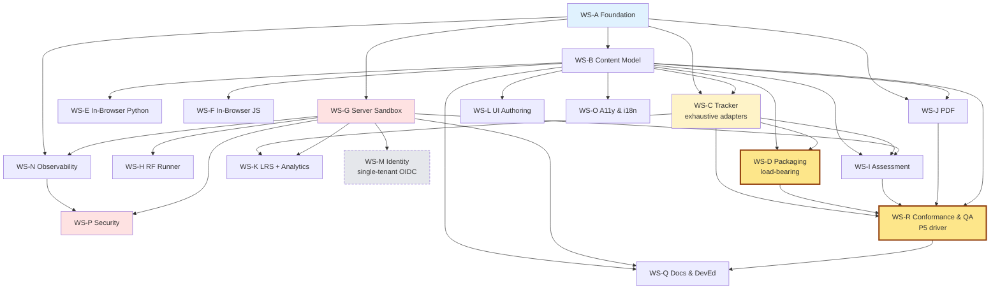

# 01 — Workstreams and Dependencies

> The 52 weeks of scope broken into 18 parallel workstreams, not six sequential phases. A workstream is an enduring capability area; a phase is a time-boxed delivery window. Each workstream has an owner role, exit criteria, and phase checkpoints.

Phases referenced: P0–P5 (see [`02-phase-plan.md`](./02-phase-plan.md)).
Role names: **FE-1**, **FE-2** (senior full-stack), **BE-1** (FastAPI/runner specialist, emerging from FE pool in P2), **Many** (fractional architect + RF/rf-mcp owner + packaging + conformance authority), **ACC** (accessibility specialist, hire before P4), **ID** (instructional-design/pedagogy advisor, hire before P4 dashboards). See [`08-team-and-raci.md`](./08-team-and-raci.md) for RACI detail.

> Scope narrowed 2026-04-21 per [ADR 0022](../adr/0022-oss-single-tenant-framework-scope.md): Lernkit is an OSS single-tenant framework whose Phase 5 success metric is **LMS conformance coverage**, not an enterprise pilot. No hosted SaaS, no multi-tenant isolation, no billing, no marketplace, no dedicated security-engineer hire. Workstreams below reflect that scope. Operational posture follows [ADR 0021](../adr/0021-self-host-first-infrastructure-principle.md) (self-host-first).

## WS-A — Foundation

**Owner:** FE-1 (accountable), Many (consulted on ADRs).
**Scope:** pnpm workspaces monorepo; Turborepo task pipeline; Astro + Starlight baseline; GitHub Actions CI; Coolify deployment recipe; ADR and DDD directory hygiene; CHANGELOG tooling; Renovate config.
**Dependencies:** none — upstream of everything.
**Exit criteria:** `pnpm create lernkit` works; a commit to `main` produces a staging URL within 8 min; ADRs 0001–0013 in `accepted` status.
**Phase checkpoints:** P0 (baseline), P1 (linked to WS-B schemas), P2 (build matrix hardening), P5 (conformance-stack hardening). Multi-tenant-config checkpoint struck — scope narrowed 2026-04-21 per [ADR 0022](../adr/0022-oss-single-tenant-framework-scope.md).
**DDD contexts:** cross-cutting.

## WS-B — Content Model

**Owner:** FE-1.
**Scope:** content collections (`src/content/courses/**`), Zod frontmatter schemas (course, module, lesson, objective), MDX component library Tier 1, Markdoc optional path, H5P embed wrapper, i18n skeleton.
**Dependencies:** WS-A (monorepo, Astro baseline).
**Exit criteria:** all 23 Tier 1 vocabulary items render; schemas produce actionable build errors (measured per [`00-quality-attribute-goals.md`](./00-quality-attribute-goals.md) §7); Markdoc parity for prose + callouts + quizzes.
**Phase checkpoints:** P1 (Tier 1 ships), P3 (Tier 2 + H5P embed), P4 (live updates via Keystatic), P5 (schema polish for conformance-edge cases). Marketplace-catalog checkpoint struck — scope narrowed 2026-04-21 per [ADR 0022](../adr/0022-oss-single-tenant-framework-scope.md).
**DDD contexts:** *Authoring*, *Content Rendering*.

## WS-C — Tracker Abstraction

**Owner:** FE-2 (accountable), Many (consulted).
**Scope:** unified `Tracker` TypeScript interface; 5 adapters (`ScormAgainAdapter12`, `ScormAgainAdapter2004`, `Cmi5Adapter`, `XapiAdapter`, `NoopAdapter`); event routing from widgets to adapter; xAPI statement schema registry. **Adapters must be exhaustive — no MVP shortcuts.** Every tracker field defined by SCORM 1.2, SCORM 2004 4th Ed, cmi5, and xAPI 2.0 / IEEE 9274.1.1 must be represented in the `Tracker` interface and round-tripped by the relevant adapter. Scope narrowed 2026-04-21 per [ADR 0022](../adr/0022-oss-single-tenant-framework-scope.md): exhaustiveness here is what feeds WS-D packaging depth and WS-R conformance coverage.
**Dependencies:** WS-A (TypeScript config), WS-B (widget events). **Tied to WS-D and WS-R** — an adapter gap is a packaging gap is a conformance-matrix hole.
**Exit criteria:** every widget calls `tracker.*` only (no direct scorm-again or @xapi imports in components); adapter swap via build flag; 80% line coverage per [`00-quality-attribute-goals.md`](./00-quality-attribute-goals.md) §6; per-adapter field-coverage checklist at 100% against the relevant spec.
**Phase checkpoints:** P1 (interface + Noop + ScormAgain 1.2), P3 (2004, cmi5, xAPI), P5 (analytics enrichers + exhaustive field-coverage verification against WS-R nightly suite).
**DDD contexts:** *Tracking*, *Packaging & Export*.

## WS-D — Packaging Pipeline

**Owner:** FE-2 (accountable), Many (co-owner for packaging depth + conformance authority).
**Scope:** unified manifest from frontmatter; five packagers (scorm12, scorm2004-4th, cmi5, xapi-bundle, plain-html); Nunjucks/Handlebars manifest templates; zip builder with macOS-safe layout; SCORM Cloud REST API integration for CI conformance. **This is the load-bearing workstream per scope narrow 2026-04-21 (see [ADR 0022](../adr/0022-oss-single-tenant-framework-scope.md)).** The product exists to emit conformant packages; everything else is scaffolding.
**Dependencies:** WS-C (adapter wiring), WS-B (frontmatter schemas). **Drives the nightly LMS conformance suite in WS-R.**
**Exit criteria:**
- all five packagers emit valid artifacts; SCORM Cloud conformance green in CI on main;
- `simple-scorm-packager` vendored per ADR 0014;
- imsmanifest.xml at zip root verified by unit tests that inspect zip contents (Research §3.2);
- **exhaustive tracker field coverage**: every SCORM 1.2 data-model field, every SCORM 2004 4th Ed runtime element (including sequencing and navigation controls), every cmi5 AU launch/return parameter, every xAPI 2.0 / IEEE 9274.1.1 statement property we emit is documented and has a corresponding round-trip test;
- **no field-coverage gaps**: a per-standard field-coverage report is published at release and must read 100% on shipped vocabulary.
**Phase checkpoints:** P1 (scorm12 + plain-html), P3 (scorm2004-4th, cmi5, xapi-bundle), P5 (exhaustive field coverage, 2004 sequencing polish, cmi5 moveOn/return-URL completeness, re-import reverse operation stretch).
**DDD contexts:** *Packaging & Export*.

## WS-E — In-Browser Python

**Owner:** FE-2.
**Scope:** Pyodide 0.29.x self-hosted; Web Worker + Comlink + Coincident fallback; stdout/stderr streaming; matplotlib backend; micropip install hook; state persistence (`cellGroup`); `<RunnablePython>` component; experimental `<RunnableRF-pyodide>` (Research §4.1).
**Dependencies:** WS-A (serving + cache headers), WS-B (component API).
**Exit criteria:** 10-cell Python lesson cold-loads < 3 s on warm cache (per [`00-quality-attribute-goals.md`](./00-quality-attribute-goals.md) §3); matplotlib plot renders inline; `input()` works on isolated runtime page.
**Phase checkpoints:** P2 (primary delivery), P3 (Service Worker pre-cache), P4 (lightweight MicroPython mode for mobile — stretch).
**DDD contexts:** *Code Execution*.

## WS-F — In-Browser JS

**Owner:** FE-1.
**Scope:** Sandpack integration for component demos; sandboxed iframe for snippets; `<RunnableJS>` component; CodeMirror 6 editor (ADR 0015); decision point on WebContainers (customer-provided license only, Research §4.2).
**Dependencies:** WS-A (Astro islands), WS-B (component API).
**Exit criteria:** React component demo hot-reloads in Sandpack; snippet iframe has `sandbox="allow-scripts"` without `allow-same-origin`; bundle within the 300 KB runnable-page budget (per [`00-quality-attribute-goals.md`](./00-quality-attribute-goals.md) §3).
**Phase checkpoints:** P3 (primary delivery), P4 (polish + themes).
**DDD contexts:** *Code Execution*.

## WS-G — Server Sandbox

**Owner:** BE-1 (accountable), Many (consulted on Docker + runsc).
**Scope:** FastAPI + Uvicorn service; Docker + gVisor runsc warm container pool; `/exec`, `/rf`, `/xapi`, `/progress` routes; Redis-backed quotas and rate limits; WebSocket/SSE streaming; Postgres + SQLAlchemy 2 schema; per-language runner images (python:3.13-slim, node:20-slim, rf-mcp:latest).
**Dependencies:** WS-A (CI, Coolify), ADR 0007 (stack), ADR 0008 (hardening checklist).
**Exit criteria:** `/exec` p99 < 1 s at warm pool (per [`00-quality-attribute-goals.md`](./00-quality-attribute-goals.md) §3); hardening checklist items 1:1 with Research §4.3 and ADR 0008; k6 100-concurrent load test passes; red-team sandbox-escape tabletop finds no new issues (P3+).
**Phase checkpoints:** P1 (auth + health + stub), P3 (primary delivery + gVisor), P5 (sandbox depth polish). Firecracker-for-multi-tenant checkpoint struck — scope narrowed 2026-04-21 per [ADR 0022](../adr/0022-oss-single-tenant-framework-scope.md); single-tenant substrate does not need it. Firecracker remains documented as a self-host opt-in per ADR 0008.
**DDD contexts:** *Code Execution*.

## WS-H — Robot Framework Runner

**Owner:** Many (accountable), BE-1 (responsible).
**Scope:** two operational modes per Research §4.4 — grading/batch (`robot` CLI + `output.xml` parse) and tutorial/guided (`rf-mcp` MCP HTTP server with `learning_exec` tool profile); log.html/report.html served from isolated origin; beginner-vs-advanced library split (`rf-mcp:latest` vs `rf-mcp-vnc`); upstream contribution cadence.
**Dependencies:** WS-G (runner pool), rf-mcp upstream (Many controls cadence).
**Exit criteria:** end-to-end RF lesson (write test, execute, grade, resume, emit xAPI) works in Docebo; `learning_exec` tool profile upstreamed to rf-mcp.
**Phase checkpoints:** P3 (primary delivery), P4 (AI-tutor integration), P5 (egress-policy polish for self-host operators). "Enterprise-grade" egress policy label struck — scope narrowed 2026-04-21 per [ADR 0022](../adr/0022-oss-single-tenant-framework-scope.md); the same whitelist-based egress controls are documented as the recommended single-tenant default.
**DDD contexts:** *Robot Framework Execution*.

## WS-I — Assessment

**Owner:** FE-1 (accountable), ID (consulted from P4).
**Scope:** all quiz component types (`<MCQ>`, `<MultiResponse>`, `<TrueFalse>`, `<FillBlank>`, `<Numeric>`, `<Matching>`, `<Sequence>`, `<DragDrop>`, `<Hotspot>`, `<ShortAnswer>`); `<KnowledgeCheck>`; `<QuestionBank>` random draw; `<CodeChallenge>` with hidden tests + auto-grading; xAPI statement emission for every event; mastery-aware hint ladder (Research §1.3).
**Dependencies:** WS-B (component base), WS-C (Tracker), WS-G (code challenge grader).
**Exit criteria:** Moodle imports a graded quiz and records score; SCORM Cloud receives all xAPI statements; `<CodeChallenge>` hidden tests graded server-side with per-test breakdown.
**Phase checkpoints:** P1 (MCQ/MR/TF/FIB), P2 (remainder + CodeChallenge), P3 (QuestionBank + ScenarioBranching), P4 (confidence sliders).
**DDD contexts:** *Assessment & Grading*.

## WS-J — PDF

**Owner:** FE-2.
**Scope:** Paged.js + Playwright Chromium pipeline; `/print` route; print CSS (`@page`, `string-set`, `target-counter`, margin-box headers); Mermaid pre-render to SVG; interactive-widget print fallbacks (snapshot + QR code); TOC patching; visual-regression baseline.
**Dependencies:** WS-B (content), WS-A (build pipeline).
**Exit criteria:** 100-lesson course PDF builds < 90 s (per [`00-quality-attribute-goals.md`](./00-quality-attribute-goals.md) §3); Playwright visual-regression baseline < 0.1% pixel diff across known-good pages; QR codes resolve to live URLs.
**Phase checkpoints:** P2 (primary delivery), P3 (RTL support), P5 (custom themes per customer).
**DDD contexts:** *PDF Rendering*.

## WS-K — LRS + Analytics

**Owner:** BE-1 (accountable), ID (consulted from P4).
**Scope:** self-hosted Yet Analytics SQL LRS (Docker + Postgres); `/xapi` proxy service in FastAPI; author analytics dashboard (completion, quiz difficulty, time-on-task, code-challenge success rates); learner dashboard (progress, badges, bookmarks); statement retention policy + PII scrubbing. Self-host-first per [ADR 0021](../adr/0021-self-host-first-infrastructure-principle.md).
**Dependencies:** WS-C (xAPI adapter), WS-G (proxy endpoint).
**Exit criteria:** LRS ingests all statement shapes from Research §4.5; author dashboard shows statement-to-display latency ≤ 5 s (per P4 success metric, Research §8 Phase 4); retention policy documented.
**Phase checkpoints:** P3 (LRS + proxy online), P4 (dashboards primary delivery), P5 (raw xAPI archive export confirmed). BI-export-to-S3/parquet checkpoint struck — scope narrowed 2026-04-21 per [ADR 0022](../adr/0022-oss-single-tenant-framework-scope.md); customers consume the raw xAPI archive the LRS already provides.
**DDD contexts:** *LMS Launch / LRS Gateway*, *Learner Progress*.

## WS-L — UI Authoring

**Owner:** FE-1 (accountable), ID (consulted).
**Scope:** Keystatic integration in the Astro app; schemas matching WS-B content collections; custom block components for Quiz, RunnablePython, Terminal usable in the editor; author preview mode; Sveltia CMS fallback ready for drop-in.
**Dependencies:** WS-B (schemas), WS-A (deploy).
**Exit criteria:** non-developer author creates a new lesson without terminal (per Research §8 Phase 4 success metric).
**Phase checkpoints:** P4 (primary delivery), P5 (conformance-aware authoring polish). Marketplace-aware-workflows checkpoint struck — scope narrowed 2026-04-21 per [ADR 0022](../adr/0022-oss-single-tenant-framework-scope.md).
**DDD contexts:** *Authoring UI*.

## WS-M — Identity (single-tenant OIDC adapter)

> **Scope narrowed 2026-04-21 per [ADR 0022](../adr/0022-oss-single-tenant-framework-scope.md).** Previously "Identity & Tenancy" with multi-tenant isolation, RLS, schema-per-tenant, Stripe billing, and organization-level administration. All of that is out of scope. The workstream now covers a single-tenant OIDC adapter only. Customers wire Lernkit to their own IdP.

**Owner:** BE-1 (accountable), Many (consulted).
**Scope:** a generic OIDC adapter (PKCE, `state`, signed-ID-token verification, issuer allow-list) that a deployment wires to one IdP (Keycloak, Azure AD, Okta, Google Workspace, or any compliant OP) via environment config; three roles — **author**, **reviewer**, **learner** — with route-level checks; session handling; logout propagation. One org per deployment.
**Out of scope** (struck 2026-04-21, per [ADR 0022](../adr/0022-oss-single-tenant-framework-scope.md)): multi-tenant data isolation, Postgres row-level security, schema-per-tenant, organization-level owner role beyond deployment admin, Stripe billing, per-tenant quota enforcement, vendor-specific IdP connectors as first-class features, three-IDP dogfooding gate.
**Dependencies:** WS-G (FastAPI base). No longer depends on WS-K per-tenant scoping — a Lernkit LRS instance is per-deployment, not per-tenant.
**Exit criteria:** OIDC reference flow works against Keycloak (used as the generic-OP reference); ID-token validation covers issuer + audience + signature + expiry + nonce; three-role matrix has route-level tests.
**Phase checkpoints:** P5 (primary delivery, reduced scope).
**DDD contexts:** *Identity & Tenancy* (context retains the name but the tenancy concept collapses to single-tenant).

## WS-N — Observability

**Owner:** BE-1.
**Scope:** OpenTelemetry traces/metrics/logs across FastAPI + Node build + runner pool; Grafana + Loki + Tempo self-hosted on Coolify; **GlitchTip self-hosted** for error tracking (per [ADR 0021](../adr/0021-self-host-first-infrastructure-principle.md), replacing Sentry SaaS); alert routing via email / Mattermost webhooks (self-host-first 2026-04-21 per ADR 0021; PagerDuty dropped); dashboards per [`06-observability-plan.md`](./06-observability-plan.md); on-call runbook stubs.
**Dependencies:** WS-G (traced service), WS-A (deploy infra).
**Exit criteria:** all SLIs in [`06-observability-plan.md`](./06-observability-plan.md) have dashboards; one quarterly incident drill passes within SLOs.
**Phase checkpoints:** P1 (traces + errors), P3 (dashboards + SLOs), P5 (alert-routing polish). SLA-grade-alerting checkpoint struck — scope narrowed 2026-04-21 per [ADR 0022](../adr/0022-oss-single-tenant-framework-scope.md); self-host operators set their own SLAs.
**DDD contexts:** cross-cutting.

## WS-O — Accessibility & Internationalization

**Owner:** ACC (accountable from P4), FE-1 (responsible before hire).
**Scope:** WCAG 2.2 AA conformance across all shipped widgets; axe-core in CI per route; manual VoiceOver/NVDA audit at each phase gate; keyboard navigability; RTL layout; message bundle extraction + translation workflow.
**Dependencies:** WS-B (widgets), WS-I (quizzes).
**Exit criteria:** zero Critical, zero Serious axe-core findings; VoiceOver + NVDA successfully complete the sample course end-to-end; one RTL-translated sample course (Hebrew or Arabic) ships by end of P3.
**Phase checkpoints:** P1 (CI axe-core gate), P3 (audit pass + RTL), P4 (translation workflow).
**DDD contexts:** cross-cutting but primarily *Authoring*, *Content Rendering*, *Assessment & Grading*.

## WS-P — Security Program

> **Annotated 2026-04-21 per [ADR 0022](../adr/0022-oss-single-tenant-framework-scope.md).** Enterprise-SLA bug bounty and recurring enterprise-scale pen-test cadence are dropped. Scope concentrates on sandbox threat-modeling, dependency scanning, and a credit-only disclosure program. No dedicated SEC hire — the security rotation stays shared across BE-1 + Many with ad-hoc external engagements for targeted reviews.

**Owner:** BE-1 + Many (co-accountable rotation), rotating with external vendors for targeted reviews.
**Scope:** STRIDE threat modeling focused on sandbox and LMS-launch surfaces; CSP baseline; sandbox hardening checklist (mirror of ADR 0008); secret inventory + rotation; SBOM (CycloneDX) generation; ongoing dependency scanning (Trivy, Grype, `pnpm audit signatures`, `pip-audit`); dependency governance; incident response playbook; **credit-only disclosure program** via `SECURITY.md` and GitHub Security Advisories.
**Out of scope** (struck 2026-04-21, per [ADR 0022](../adr/0022-oss-single-tenant-framework-scope.md)): monetary bug-bounty program at enterprise SLA, enterprise pen-test cadence on a recurring schedule, multi-tenant data-leak harness, per-tenant DPA review pipeline.
**Dependencies:** WS-G (sandbox), WS-M (OIDC adapter, narrowed), WS-N (detection).
**Exit criteria:** one external targeted review (sandbox) completed at P3 exit; all Critical/High remediated before P4 exit; `SECURITY.md` + GSA workflow live from P1; dependency-scan gates green on main.
**Phase checkpoints:** P0 (CSP baseline + secret scanning + `SECURITY.md`), P3 (sandbox-focused external review), P5 (credit-only disclosure program publicly active; SBOM published per release).
**DDD contexts:** cross-cutting but primarily *Code Execution* and *LMS Launch / LRS Gateway*.

## WS-Q — Documentation & Developer Education

**Owner:** FE-1 (accountable, rotating), Many (consulted).
**Scope:** Lernkit's own documentation site (built with Lernkit itself); "Author a Lesson" tutorial as the onboarding walkthrough; MDX component reference (generated from Zod schemas + story files); migration guide from commercial tools; ADR/DDD hygiene.
**Dependencies:** all — documentation trails implementation by one phase.
**Exit criteria:** time-to-first-published-lesson < 30 min (per [`00-quality-attribute-goals.md`](./00-quality-attribute-goals.md) §2); all shipped widgets have a story file and reference entry.
**Phase checkpoints:** every phase gate.
**DDD contexts:** cross-cutting.

## WS-R — Conformance & QA

> **Scope lifted 2026-04-21 per [ADR 0022](../adr/0022-oss-single-tenant-framework-scope.md).** WS-R is now the **primary Phase 5 driver**; the project's top-level success metric lives here. What was "a conformance test harness" is now "the thing the product is judged on."

**Owner:** FE-2 (accountable), Many (co-owner — conformance authority), BE-1 (responsible for backend slice).
**Scope:**
- SCORM Cloud CI integration on every main-branch push;
- **per-LMS nightly smoke tests** against **Moodle + TalentLMS + Docebo + iSpring Learn + SAP SuccessFactors (for 2004)**;
- the **public LMS compatibility matrix** as a living deliverable, published to the docs site;
- a public SCORM Cloud conformance dashboard as the trust signal;
- Playwright visual-regression harness;
- RF self-referential E2E suite;
- release conformance report generation;
- **the conformance-coverage success metric** itself: every SCORM 1.2 / 2004 4th Ed / cmi5 / xAPI package Lernkit produces imports and runs correctly on the named LMSes with 100% of interactive widget state, 100% of quiz-type xAPI statements, and bookmark / resume behavior verified by the nightly conformance suite.
**Dependencies:** WS-D (packagers — the feeder), WS-C (exhaustive adapters), WS-B (content), WS-I (quizzes).
**Exit criteria:** every main-branch push exercises all four standards through SCORM Cloud; the full LMS smoke matrix runs nightly; LMS-specific failures are tracked, not silent; release blockers auto-filed; **the P5 success metric (verbatim in [`02-phase-plan.md`](./02-phase-plan.md)) is reported green for 14 consecutive nights before Phase 5 exit.**
**Phase checkpoints:** P1 (SCORM 1.2 + SCORM Cloud), P3 (all four standards + nightly LMS on three LMSes), P4 (release reports), P5 (full five-LMS nightly + public compatibility matrix + conformance-coverage metric green). Enterprise-customer-onboarding-guide checkpoint struck — scope narrowed 2026-04-21 per [ADR 0022](../adr/0022-oss-single-tenant-framework-scope.md).
**DDD contexts:** *Packaging & Export*, *Tracking*.

## Dependency graph

> Graph updated 2026-04-21 per [ADR 0022](../adr/0022-oss-single-tenant-framework-scope.md): WS-D and WS-R are now central keystones; WS-M shrinks (fewer downstream dependents) because tenancy-scoped fan-out to WS-K and WS-P is struck.

Legend: blue = foundational, yellow = architectural keystone, **dark-yellow bold = load-bearing (post-2026-04-21 scope narrow)**, red = high-risk surface, grey dashed = scope-reduced workstream.

## Workstream-to-phase delivery matrix

| WS | P0 | P1 | P2 | P3 | P4 | P5 |
|---|---|---|---|---|---|---|
| A Foundation | ◼ primary | ◻ hardening | ◻ hardening | ◻ hardening | ◻ hardening | ◻ conformance-stack hardening |
| B Content Model |  | ◼ Tier 1 |  | ◼ Tier 2 + H5P | ◻ live updates | ◻ conformance-edge polish |
| C Tracker |  | ◼ Noop + S12 |  | ◼ S2004 + cmi5 + xAPI |  | ◼ exhaustive field coverage |
| D Packaging |  | ◼ scorm12 |  | ◼ remaining 4 |  | ◼ **exhaustive field coverage + 2004 sequencing + cmi5 moveOn** |
| E In-Browser Python |  |  | ◼ primary | ◻ Service Worker | ◻ MicroPython |  |
| F In-Browser JS |  |  |  | ◼ primary | ◻ polish |  |
| G Server Sandbox |  | ◻ stub |  | ◼ primary |  | ◻ sandbox polish |
| H RF Runner |  |  |  | ◼ primary | ◻ AI tutor | ◻ egress-policy polish |
| I Assessment |  | ◼ 4 types | ◼ remainder + CodeChallenge | ◼ QuestionBank + scenarios | ◻ confidence | ◻ xAPI statement-completeness |
| J PDF |  |  | ◼ primary | ◻ RTL |  | ◻ themes |
| K LRS + Analytics |  |  |  | ◼ LRS online | ◼ dashboards | ◻ raw archive export |
| L UI Authoring |  |  |  |  | ◼ primary | ◻ conformance-aware polish |
| M Identity (single-tenant OIDC) |  |  |  |  |  | ◼ primary (reduced scope) |
| N Observability |  | ◻ traces |  | ◼ dashboards |  | ◻ alert-routing polish |
| O A11y & i18n |  | ◻ axe gate |  | ◼ audit + RTL | ◻ translation |  |
| P Security | ◻ CSP + SECURITY.md |  |  | ◻ sandbox review |  | ◻ credit-only disclosure live |
| Q Docs & DevEd | ◻ scaffold | ◻ author walk | ◻ component ref | ◻ migration guide | ◻ author guide | ◻ conformance matrix docs |
| R Conformance & QA |  | ◼ S12 + Cloud |  | ◼ all 4 + nightly (3 LMS) | ◻ reports | ◼ **full 5-LMS nightly + public matrix + success-metric green** |

◼ = primary delivery (acceptance gate in [`02-phase-plan.md`](./02-phase-plan.md)). ◻ = incremental work. Bold cells = load-bearing for the narrowed-scope P5 success metric (added 2026-04-21 per [ADR 0022](../adr/0022-oss-single-tenant-framework-scope.md)).

## Cross-workstream coordination rituals

- **Weekly architecture review** (async-first, 60-min synchronous optional): Many chairs, one workstream owner presents the riskiest decision of the week; outputs feed [`04-risk-register.md`](./04-risk-register.md) and ADR proposals.
- **Monthly ADR review**: all `proposed` ADRs older than 14 days either accepted or explicitly deferred with reasoning.
- **Phase gate review**: every phase exit (six total) runs through the acceptance checklist in [`02-phase-plan.md`](./02-phase-plan.md); failing items move to the next phase or to the contingency list.
