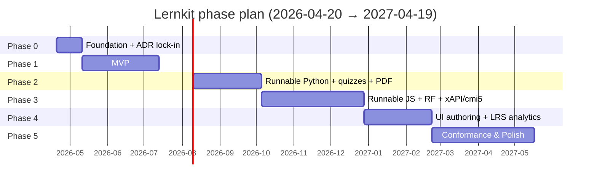

# 02 — Phase Plan

> Restructured from Research §8 into execution-ready gantt-style content. Each phase has: calendar weeks, FTE allocation per workstream, deliverables with testable acceptance criteria, exit gates with quality-attribute checks, pre-mortems, and rollback/contingency.

Workstream IDs per [`01-workstreams-and-dependencies.md`](./01-workstreams-and-dependencies.md). Quality-attribute targets per [`00-quality-attribute-goals.md`](./00-quality-attribute-goals.md). Risks by ID per [`04-risk-register.md`](./04-risk-register.md).

> **Scope narrowed 2026-04-21 per [ADR 0022](../adr/0022-oss-single-tenant-framework-scope.md).** Phase 5 is now "Conformance & Polish", not "Enterprise". Multi-tenant isolation, Stripe billing, marketplace, enterprise reporting exports, SEC hire, and enterprise-SLA bug bounty are struck. The Phase 5 success metric is LMS conformance coverage (see §Phase 5 below, verbatim). Operational posture follows [ADR 0021](../adr/0021-self-host-first-infrastructure-principle.md).

## Gantt view

> Phase 5 ends at its original week 52 (2027-04-19). The ~4 weeks of slack previously reserved for enterprise-pilot readiness are now absorbed by conformance depth on edge-LMS cases (SAP SuccessFactors 2004 sequencing, iSpring Learn xAPI quirks, Docebo cmi5 return-URL variants). Scope narrowed 2026-04-21 per [ADR 0022](../adr/0022-oss-single-tenant-framework-scope.md).

## Phase 0 — Foundation (Weeks 1–3, 2026-04-20 → 2026-05-11)

**Goal.** Monorepo bootstrapped, CI green, staging environment auto-deploying, ADRs 0001–0013 in `accepted` status.

> **FTE table ratified 2026-04-21** (closes OQ-P0-2 in [`10-open-questions.md`](./10-open-questions.md)); next review at P1 exit. The P5 allocation was re-shaped the same day by the scope narrow in [ADR 0022](../adr/0022-oss-single-tenant-framework-scope.md) — Billing / Marketplace / Enterprise-reporting / SEC-hire hours redistributed into WS-D, WS-R, and WS-P.

**FTE allocation (7.5 FTE-weeks total).**

| WS | FE-1 | FE-2 | Many |
|---|---|---|---|
| WS-A Foundation | 2.5 | 1.5 | 0.5 |
| WS-B Content Model (schemas only) | 0.5 | — | — |
| WS-G Server Sandbox (skeleton) | — | 0.5 | — |
| WS-P Security (CSP baseline) | 0.5 | — | — |
| WS-Q Docs (scaffold) | 0.5 | 0.5 | — |
| ADR drafting (shared) | 0.5 | 0.5 | 0.5 |

**Deliverables.**

1. pnpm workspaces monorepo with Turborepo; sample apps for `site/`, `runner/`, `packagers/`.
2. Astro 5 + Starlight + MDX baseline with one sample lesson.
3. FastAPI service skeleton (`/healthz`, `/readyz`, `/version`) deployed to Coolify on Hetzner staging.
4. GitHub Actions: lint (biome, ruff), type (tsc, mypy), unit tests (vitest, pytest), secret scan (gitleaks).
5. Coolify branch-deploy recipe triggered per PR.
6. ADRs 0001–0013 authored, reviewed, status=accepted.
7. DDD strategic overview in [`../ddd/00-strategic-overview.md`](../ddd/00-strategic-overview.md) (already exists) + one context model per core context.
8. CHANGELOG at `CHANGELOG.md`, Keep-a-Changelog format, initial entry.

**Acceptance criteria (testable).**

- `pnpm install && pnpm build` succeeds on a clean checkout in < 3 min.
- A PR to `main` produces a Coolify preview URL within 8 min of `git push`.
- `curl https://staging.lernkit.example/healthz` returns `{"status":"ok"}`.
- `gh workflow view ci.yml` shows green on `main` for 3 consecutive days.
- `pnpm --filter site build:scorm` emits a zip that SCORM Cloud accepts as valid (even if content is trivial).

**Exit gate (all must be true).**

- [ ] Acceptance criteria above all pass.
- [ ] ADRs 0001–0013 all `accepted`.
- [ ] No Critical/High CVEs in initial dependency scan (per [`00-quality-attribute-goals.md`](./00-quality-attribute-goals.md) §4).
- [ ] CSP baseline deployed on staging (`default-src 'self'`, no `unsafe-inline`).
- [ ] First round of [`10-open-questions.md`](./10-open-questions.md) with owners and deadlines assigned.

**Pre-mortem (what fails).**

1. **Bikeshedding on MDX-vs-Markdoc.** Mitigation: ADR 0016 pre-written; primary MDX, optional Markdoc — decision forced by 2026-04-27.
2. **Coolify + Hetzner provisioning slower than expected.** Mitigation: backup plan uses Fly.io/Railway for P0 only; switch to Hetzner before P1.
3. **ADR writing backs up (one person, 13 ADRs).** Mitigation: parallelize — each engineer owns ~4 ADRs; Many reviews.
4. **Renovate / dependency bot noise drowns signal on day one.** Mitigation: silence non-security updates in P0; tune in P1.
5. **Monorepo tooling choice (Turborepo vs Nx vs plain pnpm) drags past week 2.** Mitigation: default to Turborepo, defer Nx decision to P3 if warranted.

**Rollback/contingency.**

- If Coolify is problematic, fall back to Railway for P0 preview environments only; lock the production ADR 0013 timeline to P1.
- If any ADR in 0001–0013 fails review, it enters `proposed` state and the related workstream starts in P1 without it; plan updated in the next monthly review.

## Phase 1 — MVP: MDX + HTML + SCORM 1.2 (Weeks 4–12, 2026-05-11 → 2026-07-13)

**Goal.** Sample course renders, packages as SCORM 1.2, imports cleanly into three LMSes, emits xAPI stubs through the Tracker interface.

**FTE allocation (22.5 FTE-weeks total over 9 calendar weeks).**

| WS | FE-1 | FE-2 | Many |
|---|---|---|---|
| WS-A hardening | 1.0 | 1.0 | — |
| WS-B Content Model Tier 1 | 5.0 | 2.0 | 0.5 |
| WS-C Tracker (interface + Noop + ScormAgain 1.2) | — | 3.0 | 0.5 |
| WS-D Packaging (scorm12 + plain-html) | — | 3.0 | 0.5 |
| WS-G Server Sandbox (auth + progress stub) | 1.0 | — | — |
| WS-I Assessment (MCQ, MR, TF, FIB) | 2.0 | — | — |
| WS-N Observability (traces + errors) | — | 0.5 | — |
| WS-O A11y (axe-core CI gate) | 0.5 | — | — |
| WS-Q Docs (author walkthrough) | 1.0 | — | 0.5 |
| WS-R Conformance (SCORM Cloud CI) | — | 1.0 | — |

**Deliverables.**

1. Zod-validated frontmatter schemas for course, module, lesson, objective.
2. MDX components for all 23 Tier 1 vocabulary items.
3. Shiki syntax highlighting for Python, JS/TS, Robot Framework, Bash, YAML, SQL.
4. Unified `Tracker` interface + `NoopAdapter` + `ScormAgainAdapter12`.
5. SCORM 1.2 packager with Nunjucks imsmanifest template and zip builder.
6. Pagefind static search integrated into Starlight build.
7. `/progress` CRUD in FastAPI (user, course, lesson, state).
8. Sample course "Intro to Python" published publicly at `courses.lernkit.example/intro-python`.
9. SCORM Cloud REST API conformance check in CI on every main-branch push.
10. axe-core CI gate per route; budget = zero Critical, zero Serious findings.

**Acceptance criteria (testable).**

- Sample course imports into Moodle, TalentLMS, SCORM Cloud with zero errors.
- Completion and score events appear correctly in each of the three LMSes (verified by manual test matrix).
- All 23 Tier 1 vocabulary widgets render with valid HTML, pass axe-core, and emit the correct xAPI stub.
- Initial HTML payload on prose page < 50 KB gzipped; prose-page JS < 15 KB gzipped (per [`00-quality-attribute-goals.md`](./00-quality-attribute-goals.md) §3).
- Author onboarding walkthrough completes in < 30 min on the monthly stopwatch test (per [`00-quality-attribute-goals.md`](./00-quality-attribute-goals.md) §2).
- SCORM Cloud REST API round-trip < 2 min in CI (per [`00-quality-attribute-goals.md`](./00-quality-attribute-goals.md) §5).

**Exit gate (quality-attribute check).**

- [ ] Functionality: Tier 1 parity 23/23.
- [ ] Usability: Core Web Vitals met on sample course (LCP < 2.5 s, INP < 200 ms, CLS < 0.1); author walk < 30 min.
- [ ] Performance: bundle budgets met; build time < 6 min; preview deploy < 8 min.
- [ ] Portability: three-LMS compatibility matrix green; SCORM Cloud conformance green.
- [ ] Testability: unit coverage > 80% on packagers and tracker; axe-core gate active.
- [ ] Clarity: ADRs 0001–0013 live; CHANGELOG current; at least three context models published under [`../ddd/`](../ddd/).
- [ ] Security: CSP baseline deployed in production mode; no Critical/High CVEs > 7 days old.

**Pre-mortem.**

1. **SCORM 1.2 zip layout mistakes** — macOS `__MACOSX/`, files not at root (Research §3.2). Mitigation: unit tests inspect zip contents; CI fails if either artifact appears. Risk ID R-03 in [`04-risk-register.md`](./04-risk-register.md).
2. **Absolute asset URLs break in LMS iframes.** Mitigation: post-build URL-rewriter; verified by import into Moodle.
3. **axe-core noise from Starlight's own components.** Mitigation: baseline findings documented as known issues, new regressions only fail the build.
4. **Tracker interface proves insufficient when SCORM 2004 / cmi5 land in P3.** Mitigation: explicit P3 review point for interface extension; versioned in `@lernkit/tracker` semver.
5. **Sample course quality feels amateurish, undermining dogfood value.** Mitigation: ID contractor reviews the course before P1 exit (one-off engagement, not yet the full ID hire).

**Rollback/contingency.**

- If 23/23 Tier 1 vocabulary slips, ship the core 15 (those in the "top 15 patterns" of Research §1.4) and defer the rest to P2 — do not slip the phase.
- If three-LMS compatibility matrix fails on one LMS (Moodle or TalentLMS or Docebo), document the issue, open a follow-up workstream ticket, and proceed if at least two pass plus SCORM Cloud.
- If SCORM Cloud CI is throttled (risk R-15), fall back to nightly conformance instead of per-push.

## Phase 2 — Runnable Python + quizzes + PDF (Weeks 13–20, 2026-07-13 → 2026-09-07)

**Goal.** `<RunnablePython>` ships; remaining quiz types and `<CodeChallenge>` ship; PDF export is print-shop quality.

**FTE allocation (20 FTE-weeks total over 8 calendar weeks).**

| WS | FE-1 | FE-2 | Many |
|---|---|---|---|
| WS-B Content Model (widget polish) | 1.0 | 1.0 | — |
| WS-E In-Browser Python | — | 4.0 | 0.5 |
| WS-I Assessment (remainder + CodeChallenge) | 3.0 | — | — |
| WS-J PDF | 1.0 | 3.0 | — |
| WS-G Server Sandbox (progress API hardening) | 1.0 | — | — |
| WS-R Conformance (SCORM Cloud regression) | — | 1.0 | — |
| WS-Q Docs (component reference) | 1.0 | — | 0.5 |
| ADR upkeep + arch review | 0.5 | 0.5 | 1.0 |

**Deliverables.**

1. `<RunnablePython>` with Pyodide 0.29.x self-hosted, Web Worker + Comlink, stdout/stderr streaming, matplotlib inline rendering, micropip hook.
2. `<CodeChallenge>` with hidden tests, auto-grading, per-test-breakdown xAPI emission.
3. Remaining quiz types: `<Matching>`, `<Sequence>`, `<DragDrop>`, `<Hotspot>`, `<ShortAnswer>`, `<Numeric>`.
4. `<QuestionBank>` random draw (P2 scope — pre-RF to validate component API before scenario branching).
5. Paged.js + Playwright PDF pipeline at `/print` route; Mermaid pre-rendered to SVG; QR-code print fallbacks.
6. Service Worker pre-cache for Pyodide wasm on course enter.
7. First RF-based E2E test in `tests/e2e/` exercising the sample course.

**Acceptance criteria (testable).**

- 10-cell Python lesson cold-loads < 3 s on warm cache; < 10 s p95 on throttled "Fast 3G" (per [`00-quality-attribute-goals.md`](./00-quality-attribute-goals.md) §3).
- Python state persists across cells grouped by `cellGroup`.
- `matplotlib.pyplot.show()` produces an inline canvas.
- `<CodeChallenge>` grades correctly with per-test breakdown emitted in xAPI.
- PDF of sample course renders with: cover, copyright, TOC with page numbers, running headers per chapter, code samples highlighted, Mermaid diagrams as SVG, QR codes for interactive widgets. 100-lesson synthetic course builds < 90 s on a 4-vCPU runner.
- Playwright visual-regression baseline < 0.1% pixel diff on known-good pages.

**Exit gate.**

- [ ] Functionality: Tier 1 remains at 23/23; all remaining quiz types plus `<CodeChallenge>` live.
- [ ] Usability: runnable-page LCP < 4.0 s; keyboard navigation verified for code cells.
- [ ] Performance: Pyodide cold-start < 3 s warm / < 10 s cold; PDF build < 90 s; runnable-page JS < 300 KB.
- [ ] Portability: SCORM Cloud conformance unchanged (regression test); PDF renders identically on Linux and macOS Chromium.
- [ ] Testability: first RF E2E test green; visual-regression baseline established.
- [ ] Security: Service Worker scoped correctly; no credentials in SW cache; COOP/COEP scoped to runnable-page only.
- [ ] Clarity: `<RunnablePython>` and `<CodeChallenge>` component reference docs published.

**Pre-mortem.**

1. **Pyodide cold-start exceeds budget on slow networks.** Risk R-06. Mitigation: Service Worker pre-cache + skeleton loader + "lightweight mode" toggle planned for P4.
2. **Cross-origin isolation headers break third-party embeds.** Mitigation: scope headers to runnable-code page path only, documented in ADR 0005.
3. **Paged.js edge cases on very long code blocks.** Mitigation: fallback `page.pdf()` path available per Research §5.
4. **`<CodeChallenge>` grading requires server trip, P2 has no sandbox yet.** Mitigation: P2 uses a stub grader with predeclared test fixtures; real gVisor grader lands in P3.
5. **Pyodide wasm storage bloat** (risk R-13). Mitigation: host only one minor-version at a time, purge old versions from CDN; monitor storage in Grafana.

**Rollback/contingency.**

- If `<CodeChallenge>` server grading can't wait for P3, ship a client-side grader using hidden Mocha-style assertions in Pyodide itself (weaker security for hidden tests — flag as known issue).
- If PDF quality fails print-shop review, use Playwright-only fallback (no Paged.js) for P2 and revisit Paged.js in P3 polish time.
- If 10-cell cold-start target misses, reduce target to 5-cell for P2 and track cold-start improvement as a standing KPI.

## Phase 3 — Runnable JS + RF + xAPI + cmi5 + advanced content (Weeks 21–32, 2026-09-07 → 2026-11-30)

**Goal.** Full five-adapter Tracker; gVisor-hardened sandbox; RF runner dual-mode; cmi5 end-to-end through Docebo; WCAG 2.2 AA audit pass; first external sandbox-focused security review (scope narrowed 2026-04-21 per [ADR 0022](../adr/0022-oss-single-tenant-framework-scope.md); what was previously an enterprise-scope pen-test is a targeted sandbox + LMS-launch review).

**FTE allocation (30 FTE-weeks total over 12 calendar weeks).**

| WS | FE-1 | FE-2 | BE-1 | Many |
|---|---|---|---|---|
| WS-B Content Model Tier 2 + H5P embed | 2.0 | — | — | — |
| WS-C Tracker (2004 + cmi5 + xAPI) | — | 3.0 | — | 1.0 |
| WS-D Packaging (remaining 4) | — | 3.0 | — | — |
| WS-F In-Browser JS | 3.0 | — | — | — |
| WS-G Server Sandbox (gVisor + warm pool) | — | — | 4.0 | 1.0 |
| WS-H RF Runner (grading + tutorial modes) | — | — | 2.0 | 2.0 |
| WS-I Assessment (scenarios + advanced) | 2.0 | — | — | — |
| WS-K LRS (Yet Analytics online + /xapi proxy) | — | — | 2.0 | — |
| WS-N Observability (dashboards + SLOs) | — | — | 1.0 | — |
| WS-O A11y audit + RTL | 1.0 | 0.5 | — | — |
| WS-P Security (sandbox-focused external review) | — | — | 1.0 | 0.5 |
| WS-R Conformance (all 4 standards + nightly LMS) | — | 1.0 | — | — |

Assumption: BE-1 onboarded by 2026-09-07; if not, treat WS-G and WS-K as a phase-2.5 extension with FE-2 stepping in (see [`08-team-and-raci.md`](./08-team-and-raci.md) hiring triggers).

**Deliverables.**

1. `<RunnableJS>` (Sandpack + sandboxed iframe modes).
2. FastAPI `/exec` endpoint with Docker + gVisor runsc, warm container pool, Redis quotas, WebSocket/SSE streaming.
3. `<RunnableRF>` wired to rf-mcp runner (batch + MCP tutorial modes).
4. `ScormAgainAdapter2004`, `Cmi5Adapter`, `XapiAdapter`.
5. SCORM 2004 4th Ed and cmi5 packagers; xAPI standalone bundle.
6. Yet Analytics SQL LRS self-hosted on Coolify; `/xapi` proxy in FastAPI.
7. `<Scenario>` branching component; `<H5P>` embed wrapper.
8. Advanced widgets: polished `<LabeledGraphic>`, `<Timeline>`, `<InteractiveVideo>`, `<Glossary>`.
9. Grafana dashboards per [`06-observability-plan.md`](./06-observability-plan.md).
10. First external sandbox-focused security review completed (see [`05-security-model.md`](./05-security-model.md)). Scope narrowed 2026-04-21 per [ADR 0022](../adr/0022-oss-single-tenant-framework-scope.md): not an enterprise-scope pen-test.
11. WCAG 2.2 AA audit pass across all shipped widgets.
12. One RTL-translated sample course shipped.

**Acceptance criteria (testable).**

- End-to-end RF lesson (write test → execute → graded → resume → completion) works in Docebo (cmi5) and SCORM Cloud (2004 4th).
- `/exec` p99 < 1 s at warm pool on k6 100-concurrent load test.
- LRS ingests all five xAPI statement shapes from Research §4.5.
- Nightly LMS smoke (Moodle, TalentLMS, Docebo) green for 7 consecutive days before phase exit.
- Zero Critical, zero Serious axe-core findings.
- Pen-test report: all Critical/High remediated before P4 exit; no unremediated finding carries into P4.

**Exit gate.**

- [ ] Functionality: Tier 2 parity 8/10; all five adapters live.
- [ ] Usability: WCAG 2.2 AA audit pass; RTL sample course ships.
- [ ] Performance: `/exec` p99 < 1 s; `/xapi` proxy p99 < 200 ms.
- [ ] Portability: cmi5 round-trips Docebo; SCORM 2004 round-trips SCORM Cloud; LMS matrix green across five LMSes.
- [ ] Testability: all four standards exercised per main-branch push; RF E2E suite covers top-level journeys.
- [ ] Security: sandbox-focused external review Critical/High remediated; hardening checklist verified in runner image build.
- [ ] Clarity: DDD context models complete for all 12 contexts; Tracker interface v1.0.0 released with CHANGELOG.

**Pre-mortem.**

1. **Runner cost blow-up under abuse.** Risk R-07. Mitigation: Redis quotas before container start; CPU anomaly detection; alert on quota breach.
2. **cmi5 session/registration state edge cases.** Mitigation: exhaustive SCORM Cloud cmi5 reference test matrix; automate in CI.
3. **rf-mcp image bit-rot** (risk R-18). Mitigation: Many owns upstream cadence; ghcr image tagged `v<minor>` pinned; monthly upgrade cycle.
4. **Sandbox-focused external review finds an escape.** Mitigation: stop-ship policy for sandbox-escape severity; gVisor → Firecracker upgrade path prepared in ADR 0008 (remains a documented self-host opt-in post-scope-narrow).
5. **BE-1 hire slips, WS-G + WS-K delayed.** Mitigation: FE-2 backfills partially; phase scope reduced to "cmi5 + xAPI" and SCORM 2004 slides to P4.

**Rollback/contingency.**

- If RF tutorial mode via rf-mcp proves fragile, ship only grading/batch mode in P3 and defer tutorial mode to P4.
- If SCORM 2004 4th Ed conformance fails, mark as experimental and keep users on cmi5 + SCORM 1.2; revisit P5.
- If `<H5P>` embed has licensing concerns, ship with embed disabled by default; opt-in flag required.

## Phase 4 — UI authoring + LRS analytics + dashboards (Weeks 33–40, 2026-11-30 → 2027-01-25)

**Goal.** Keystatic-based authoring; author + learner dashboards reading from LRS; `<Scrim>` v1; first AI authoring assist.

**FTE allocation (20 FTE-weeks total over 8 calendar weeks).**

| WS | FE-1 | FE-2 | BE-1 | Many | ACC | ID |
|---|---|---|---|---|---|---|
| WS-B Content Model (live updates) | 1.0 | — | — | — | — | 0.5 |
| WS-E MicroPython stretch | — | 1.0 | — | — | — | — |
| WS-K LRS Dashboards | — | — | 2.5 | — | — | 1.0 |
| WS-L UI Authoring (Keystatic) | 4.0 | 1.0 | — | — | — | 1.0 |
| `<Scrim>` v1 | 2.0 | 1.0 | — | — | — | — |
| WS-O Translation workflow | — | — | — | — | 2.0 | — |
| WS-P Pen-test remediation | — | — | 0.5 | 0.5 | — | — |
| AI authoring assist (BYO-API-key) | 1.0 | 0.5 | — | — | — | 0.5 |
| ADR + docs | 0.5 | — | — | 0.5 | — | — |

Assumption: ACC (0.5 FTE) and ID (0.5 FTE) onboarded by 2026-11-30.

**Deliverables.**

1. Keystatic integration; schemas for every WS-B collection; custom block components for `<Quiz>`, `<RunnablePython>`, `<Terminal>`.
2. Author preview mode (live reload in the Keystatic editor).
3. Author analytics dashboard (completion rates, quiz difficulty, code-challenge success, time-on-task).
4. Learner dashboard (progress across courses, badges, bookmarks).
5. `<Scrim>` v1: CodeMirror-based event recorder + player, minimal audio.
6. AI authoring assist (BYO-API-key) — prompt-to-MDX completion with schema-aware validation.
7. Translation workflow: string extraction, Crowdin or local file-based flow, in-browser language switcher.
8. Sveltia CMS fallback tested (not shipped, but proven drop-in).
9. All P3 sandbox-review Critical/High remediated.

**Acceptance criteria (testable).**

- Non-developer author creates a new lesson end-to-end in Keystatic without terminal use (per Research §8 Phase 4 success metric).
- Author dashboard shows completion rate within 5 s of statement POST.
- `<Scrim>` records and replays a 5-minute lesson; total file size < 500 KB per minute of content.
- AI authoring assist generates a valid-by-schema lesson draft from a prompt in < 30 s.
- Translation workflow: one sample course ships in three languages (English + one RTL + one European).

**Exit gate.**

- [ ] Functionality: Keystatic ships; `<Scrim>` v1 ships; AI authoring assist available behind feature flag.
- [ ] Usability: non-dev author time-to-first-published-lesson measurable < 45 min (allowing ramp-up from the 30-min dev target).
- [ ] Performance: LRS → dashboard latency < 5 s; Keystatic save → preview < 3 s.
- [ ] Portability: Sveltia drop-in smoke-tested.
- [ ] Testability: author workflow E2E covered by RF suite.
- [ ] Security: all P3 sandbox-review Critical/High remediated; credit-only disclosure program rehearsed via GitHub Security Advisories (scope narrowed 2026-04-21 per [ADR 0022](../adr/0022-oss-single-tenant-framework-scope.md); enterprise-SLA bug-bounty dropped).
- [ ] Clarity: CHANGELOG entries for every user-visible feature in P4.

**Pre-mortem.**

1. **Keystatic cadence concerns** (risk R-02/R-09). Mitigation: Sveltia fallback ready; ADR 0011 documents both paths.
2. **`<Scrim>` scope creep** (Research §8 Phase 4). Mitigation: ship a minimum viable version, defer polish to P5.
3. **LRS query performance degrades at 100k+ statements.** Mitigation: materialized views; async aggregation jobs.
4. **AI authoring produces schema-invalid MDX.** Mitigation: validator-in-the-loop; reject and retry, bounded by 3 attempts per prompt.
5. **ID advisor reveals our assessment model is pedagogically weak.** Mitigation: scope for remediation in P5; accept P4 as "technically correct, pedagogically v1".

**Rollback/contingency.**

- If Keystatic stalls, ship Sveltia instead and update ADR 0011.
- If `<Scrim>` recorder is unstable, ship playback-only of pre-authored scrims (hand-crafted event streams) in P4, full recorder in P5.
- If LRS dashboards are too slow, ship a nightly-aggregate version instead of live; mark as phase-4.5 follow-up.

## Phase 5 — Conformance & Polish (Weeks 41–52, 2027-01-25 → 2027-04-19)

> **Rewritten 2026-04-21 per [ADR 0022](../adr/0022-oss-single-tenant-framework-scope.md).** Previously "Enterprise: SSO, multi-tenant, marketplace." Now the conformance-coverage phase. Dropped: SSO-for-enterprise vendor-specific connectors, multi-tenant data isolation (RLS, schema-per-tenant), Stripe billing, course marketplace, enterprise reporting exports, security review scaled to enterprise SLA, Firecracker-for-multi-tenant, dedicated SEC hire. The original week-52 boundary is preserved; the ~4 weeks of slack previously reserved for enterprise-pilot readiness are absorbed by conformance depth on edge-LMS cases.

**Goal.** Exhaustive LMS compatibility matrix as a living public deliverable; SCORM 2004 4th sequencing polish; cmi5 full conformance (all moveOn criteria, full return-URL handling); xAPI 2.0 / IEEE 9274.1.1 conformance; H5P integration depth; Scrim v1; AI-assist (BYO API key); a public SCORM Cloud conformance dashboard as the trust signal; single-tenant OIDC adapter (WS-M, reduced scope); credit-only disclosure program publicly active.

**Success metric (verbatim).**

> Every SCORM 1.2, SCORM 2004 4th Ed, cmi5, and xAPI package Lernkit produces imports and runs correctly on SCORM Cloud + Moodle + TalentLMS + Docebo + iSpring Learn (and SAP SuccessFactors for 2004), with 100 % of interactive widget state, 100 % of quiz-type xAPI statements, and bookmark / resume behavior verified by the nightly conformance suite.

**FTE allocation (30 FTE-weeks total over 12 calendar weeks).** Hours previously assigned to Billing / Marketplace / Enterprise reporting / SLA-grade alerting / Firecracker-for-multi-tenant / SEC-led bug-bounty are redistributed into WS-D (packaging depth), WS-R (conformance matrix), and WS-P (credit-only disclosure program + sandbox review). Scope narrowed 2026-04-21 per [ADR 0022](../adr/0022-oss-single-tenant-framework-scope.md).

| WS | FE-1 | FE-2 | BE-1 | Many |
|---|---|---|---|---|
| WS-D Packaging depth (exhaustive field coverage, 2004 sequencing, cmi5 moveOn, return-URL) | 1.0 | 4.0 | 1.0 | 2.0 |
| WS-R Conformance & QA (5-LMS nightly, public matrix, conformance dashboard) | 1.0 | 3.0 | 2.0 | 1.0 |
| WS-C Tracker exhaustive field-coverage verification | — | 2.0 | — | 0.5 |
| WS-M single-tenant OIDC adapter | 1.0 | — | 2.0 | — |
| WS-K raw xAPI archive export confirmed + retention polish | — | — | 1.5 | — |
| `<Scrim>` v1 polish + `<H5P>` integration depth | 2.0 | 1.0 | — | — |
| AI-assist (BYO API key) hardening | 1.0 | 0.5 | — | — |
| WS-P sandbox-focused review + credit-only disclosure live + SBOM per release | — | — | 1.5 | 0.5 |
| WS-N alert-routing polish (Mattermost webhooks) | — | — | 0.5 | — |
| Docs: public LMS compatibility matrix + conformance dashboard + author guide | 1.0 | 0.5 | — | 0.5 |

Assumption: **no SEC hire**; security rotation shared across BE-1 + Many, with an ad-hoc external sandbox review engaged mid-phase. See [`08-team-and-raci.md`](./08-team-and-raci.md).

**Deliverables.**

1. **Exhaustive LMS compatibility matrix**, published to the docs site as a living artifact: every package Lernkit produces × {SCORM Cloud, Moodle, TalentLMS, Docebo, iSpring Learn, SAP SuccessFactors for 2004} × {import, launch, interact, complete, resume, score}.
2. **SCORM 2004 4th Ed sequencing polish**: full control-mode support (choice, flow, forwardOnly), objective map, rollup rules, pre/post condition rules; conformance-suite coverage of each.
3. **cmi5 full conformance**: all moveOn criteria (`Passed`, `Completed`, `CompletedAndPassed`, `CompletedOrPassed`, `NotApplicable`); full return-URL handling; AU launch method (`OwnWindow` / `AnyWindow`) permutations verified.
4. **xAPI 2.0 / IEEE 9274.1.1 conformance** across the statement registry, including attachments, signed statements, and the 2.0 context extensions.
5. **H5P integration depth** across the commonly-used content types (Interactive Video, Course Presentation, Quiz Set, Branching Scenario).
6. `<Scrim>` v1: CodeMirror-based event recorder + player, audio track, export to SCORM package (kept from earlier scope).
7. AI-assist (BYO API key): schema-aware MDX completion, hardened input sanitization, rate limits.
8. **Public SCORM Cloud conformance dashboard** at `docs.lernkit.example/conformance` as the trust signal.
9. **Single-tenant OIDC adapter** (WS-M, reduced scope): Keycloak as the reference OP; deployment-admin wires their own IdP via env config; three roles (author, reviewer, learner).
10. **Credit-only disclosure program publicly active** via `SECURITY.md` + GitHub Security Advisories.
11. SBOM (CycloneDX) published per release.
12. WS-K raw xAPI archive export confirmed as the supported "reporting" story (no custom BI pipeline).

**Acceptance criteria (testable).**

- **Success metric (verbatim above) green for 14 consecutive nights before Phase 5 exit.**
- Per-standard field-coverage report at 100% for shipped vocabulary across all five standards (SCORM 1.2 / 2004 4th / cmi5 / xAPI 2.0 / plain HTML).
- Public compatibility matrix auto-generated from nightly suite output; each cell links to the most recent green/red run.
- SCORM 2004 4th sequencing: every control-mode path exercised by at least one E2E run per night.
- cmi5: every moveOn criterion and launch-method combination exercised per night.
- xAPI 2.0: signed-statement round-trip verified; attachments round-trip verified.
- WS-M: OIDC reference flow works against a dockerized Keycloak in CI; role-matrix tests cover every route.
- `SECURITY.md` published; first GSA-based advisory workflow rehearsed (no finding required).
- SBOM attached to each release; Trivy + Grype pass on release images.

**Exit gate.**

- [ ] Functionality: exhaustive-coverage suite reads 100% on shipped vocabulary; `<Scrim>` v1 ships; H5P integration depth ships; AI-assist ships behind feature flag.
- [ ] Usability: conformance dashboard discoverable within one click from the docs home; author guide for LMS-specific packaging caveats published.
- [ ] Performance: nightly conformance suite completes within 4 h on the shared runner; dashboard aggregates without manual refresh.
- [ ] Portability: success-metric green for 14 consecutive nights (see verbatim above).
- [ ] Testability: 5-LMS nightly matrix running; per-standard field-coverage report automated.
- [ ] Security: sandbox-focused external review done; Critical/High remediated; credit-only disclosure program publicly active; SBOM published per release.
- [ ] Clarity: public compatibility matrix live; known-regressions doc published with links to LMS-side bug trackers; CHANGELOG entry per user-visible feature.

**Pre-mortem.**

1. **LMS regressions on our side after we shipped conformant packages.** Risk R-27. Mitigation: per-standard field-coverage regression tests in CI on every main push; each packager has a golden-package fixture whose manifest + runtime elements are diffed on every build.
2. **LMS regressions on their side (Moodle / TalentLMS / Docebo / iSpring / SuccessFactors).** Risk R-27. Mitigation: nightly smoke detects; we publish a "known-regressions" doc referencing each LMS's bug tracker; customers get a dated status per cell.
3. **SCORM Cloud free-tier throttling against our CI as conformance-surface expands.** Risk R-26. Mitigation: cache conformance results by manifest hash; parallelism limit; fall back to Rustici Engine self-host if throttling becomes chronic.
4. **Edge-LMS quirks (SAP SuccessFactors 2004 sequencing, iSpring xAPI variants) consume the absorbed-slack 4 weeks.** Mitigation: triage into "fix in Lernkit" vs "document as LMS-side caveat"; cap the former at 60% of slack to avoid whack-a-mole.
5. **cmi5 return-URL handling exposes undefined behavior across LMSes.** Mitigation: each LMS gets a return-URL matrix row; behaviors that differ get a docs callout rather than an inconsistent Lernkit workaround.

**Rollback/contingency.**

- If one LMS in the matrix has a blocking regression we cannot work around, mark that cell red, publish the workaround, and do **not** ship a dirty fix; conformance honesty is the product.
- If SCORM Cloud throttling becomes chronic, spin up self-hosted Rustici Engine for CI and retain SCORM Cloud for the public dashboard only.
- If WS-M OIDC adapter slips, ship plain-HTML + file-based auth recipe for P5 and defer OIDC to a point release — the framework is still usable for self-host learners.

## Quality-gate check matrix (summary)

Each row is a hard gate at phase exit; failing any row blocks phase transition unless explicitly rolled back per that phase's contingency.

| Attribute | P0 | P1 | P2 | P3 | P4 | P5 |
|---|---|---|---|---|---|---|
| Functionality | baseline | Tier 1 23/23 | + CodeChallenge | Tier 2 8/10 + all adapters | Keystatic + Scrim v1 | exhaustive field coverage + conformance metric green |
| Usability (CWV) | n/a | LCP/INP/CLS met | runnable-page LCP < 4 s | WCAG 2.2 AA + RTL | author < 45 min | conformance dashboard discoverable ≤ 1 click |
| Performance (Pyodide) | n/a | n/a | < 3 s warm / < 10 s cold | dashboards SLO | unchanged | unchanged |
| Performance (/exec) | n/a | n/a | n/a | p99 < 1 s | unchanged | unchanged |
| Portability (LMS) | staging deploy | 3-LMS green | SCORM Cloud regression | 5-LMS + cmi5 Docebo | + author WF | 5-LMS nightly green 14 nights; success-metric verbatim |
| Testability (unit) | smoke | > 80% packaging/tracker | + Service Worker tests | + RF E2E top journeys | + author WF E2E | + per-standard field-coverage report |
| Security | CSP baseline + SECURITY.md | no Critical/High > 7d | + COOP/COEP scoped | sandbox-focused review Critical/High remediated | disclosure program rehearsed | credit-only disclosure live + SBOM per release |
| Clarity | ADRs 0001–0013 | CHANGELOG live | component ref | 12 DDD contexts | + P4 CHANGELOG | + public compatibility matrix + known-regressions doc |

If a gate fails: open a risk register entry, decide rollback (per phase contingency) at the next weekly architecture review, and if scope moves, update the delivery matrix in [`01-workstreams-and-dependencies.md`](./01-workstreams-and-dependencies.md).
