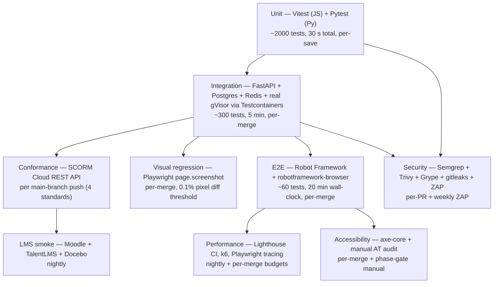

# 03 — Test Strategy

> The test pyramid as actually implemented across Lernkit, the FastAPI backend, and the self-referential Robot Framework E2E suite. Targets are numeric and tied to [`00-quality-attribute-goals.md`](./00-quality-attribute-goals.md) §6.

## The pyramid at a glance

The pyramid is tall by design — the base is deliberately wide so that the slow layers (E2E, LMS smoke, pen-tests) have fewer things to prove.

## 1. Unit — Vitest (JS) and Pytest (Python)

**Scope.**

- **Node/Browser side (Vitest):** packaging library (`@lernkit/packagers`), tracker adapters (`@lernkit/tracker`), frontmatter schemas, MDX component pure helpers, manifest generators.
- **Python side (Pytest):** FastAPI route handlers (with dependency injection mocks), SQLAlchemy models, RF output.xml parsers, xAPI statement builders.

**Targets.**

- **Coverage:** ≥ 80% line coverage on `@lernkit/packagers` and `@lernkit/tracker` (these are shipped in every SCORM package and cannot regress). 70% elsewhere.
- **Wall-clock:** total unit-test run < 30 s (Vitest parallel + Pytest with pytest-xdist).
- **Determinism:** zero flakes across 100 consecutive CI runs; any flake fails the PR.

**Conventions.**

- Test names are ubiquitous-language sentences (per [`00-quality-attribute-goals.md`](./00-quality-attribute-goals.md) §7 *Clarity*):
  - Good: `test("a SCORM 1.2 adapter writes lesson_status before terminate")`
  - Bad: `test("scorm12_adapter_lessonStatus")`
- Snapshot tests are allowed only for Nunjucks manifest output and imsmanifest.xml — both have clear schemas.
- Mocks at the module boundary only; avoid deep mocks of third-party libraries.

**Tooling.**

- Vitest with `@vitest/coverage-v8`; config at `vitest.config.ts` per package.
- Pytest with `pytest-cov`, `pytest-xdist`, `pytest-asyncio`; config at `pyproject.toml`.
- Coverage reports uploaded to CI artifact store; trend in Grafana via the CI exporter.

**Phase introduction.** P0 (scaffold, trivial tests), P1 (80% on packagers + tracker), continuous.

## 2. Integration — FastAPI + Postgres + Redis + real gVisor via Testcontainers

**Scope.**

- Every FastAPI route exercised with a real Postgres 16 container, real Redis 7 container, and (for `/exec` and `/rf`) a real gVisor-runsc container.
- SQLAlchemy migration tests (forward and backward) per release.
- Redis quota-enforcement tests (race conditions on concurrent bursts).
- xAPI proxy tests against a real Yet Analytics LRS container.

**Targets.**

- **Wall-clock:** full integration suite < 5 min.
- **Count:** approximately 300 tests by end of P3.
- **Isolation:** each test gets a fresh Postgres schema and Redis DB number; teardown is mandatory.

**Conventions.**

- Use `testcontainers-python` for the backend stack; `@testcontainers/node` or Docker Compose harness for the build pipeline.
- No shared fixtures across top-level test modules — avoids order-dependence.
- Fixture data generated via `factory_boy` (Python) or `@lernkit/test-factories` (Node).

**Phase introduction.** P1 (auth + progress routes), P3 (full `/exec`, `/rf`, `/xapi` coverage).

## 3. Conformance — SCORM Cloud REST API

**Scope.**

- Every main-branch push uploads a freshly packaged sample course in each of the four standards (SCORM 1.2, SCORM 2004 4th, cmi5, xAPI bundle) and executes a scripted learner session through SCORM Cloud's REST API.
- Verifies: import success, session launch, completion status, score, interaction records, xAPI statement emission.

**Targets.**

- **Coverage:** all four standards round-tripped.
- **Round-trip time:** < 2 min per standard in CI.
- **Gate:** failure on SCORM Cloud (our reference implementation per Research §3.3) blocks merge to main; failure on any subsequent LMS-specific smoke (see §4) files a tracked issue but does not block.

**Secrets.** SCORM Cloud API token stored in GitHub Actions encrypted secret; rotated every 90 days (per [`05-security-model.md`](./05-security-model.md) secret inventory).

**Throttling contingency.** Risk R-15 — SCORM Cloud free tier may throttle at high CI volume. Mitigation: cache unchanged packages by content hash; only upload-and-launch when the package hash differs from the last green run; fall back to nightly runs if throttling triggers.

**Phase introduction.** P1 (SCORM 1.2), P3 (all four standards).

## 4. LMS-specific smoke — Moodle + TalentLMS + Docebo

**Scope.**

- Nightly runs against staging-deployed packages in three additional LMSes.
- Uses the LMSes' respective admin APIs (Moodle Web Services, TalentLMS API, Docebo API) to import the package and read back completion/score.
- Compatibility matrix published at `docs/compatibility/` updated automatically from nightly results.

**Targets.**

- **Green streak:** 7 consecutive days required at each phase gate.
- **Flakes:** rerun once on transient network error; second failure becomes a tracked ticket.

**Why these three.**

- **Moodle:** the most-deployed open-source LMS; known gaps on SCORM 2004 sequencing (Research §3.3).
- **TalentLMS:** SCORM 1.2 only — our canary for the universal-compatibility floor.
- **Docebo:** the best cmi5 pilot target per Research §3.3.

**Phase introduction.** P3.

## 5. E2E — Robot Framework + robotframework-browser against staging

**Scope.**

- Staging environment exercised end-to-end: author writes a lesson in MDX, packager emits zip, learner session plays through, xAPI statements appear in LRS, learner dashboard reflects progress.
- Written in Robot Framework (dogfooding the framework itself, per Research §7). Suites live at `tests/e2e/*.robot`.
- `robotframework-browser` (Playwright-based) drives the browser.

**Targets.**

- **Wall-clock:** < 20 min for the full suite per merge to main.
- **Top-level journeys covered:** author flow, learner flow, packaging flow, LMS launch flow, dashboard flow — 100% by end of P3.
- **Self-reference:** the test suite is itself a Lernkit course, so the authoring DX is exercised by writing the test suite.

**Conventions.**

- Keyword libraries split by bounded context (`AuthoringKeywords.robot`, `PackagingKeywords.robot`, `TrackingKeywords.robot`).
- Avoid implicit waits; use `robotframework-browser`'s explicit waiters.
- Keyboard-only smoke as a dedicated suite (per [`00-quality-attribute-goals.md`](./00-quality-attribute-goals.md) §2 *Usability*).

**Phase introduction.** P2 (first E2E test), P3 (top-journey coverage), continuous.

## 6. Accessibility — axe-core in CI + manual AT audit per phase gate

**Scope.**

- **Automated:** `@axe-core/playwright` scan per route on every PR. Budget: zero Critical, zero Serious.
- **Manual:** VoiceOver on macOS, NVDA on Windows — smoke-pass through the sample course at each phase gate. Written report stored at `docs/accessibility/phase-<N>-audit.md`.
- **Keyboard-only:** dedicated RF suite that completes the sample course without pointer events.

**Targets.**

- **Per-PR:** zero Critical, zero Serious axe findings.
- **Phase-gate manual:** no Critical finding from VoiceOver/NVDA spot-check; any Serious must be triaged with a ticket within 5 business days.
- **WCAG 2.2 AA:** full conformance audit passes by end of P3.

**Tooling.**

- `@axe-core/playwright` wired into the RF E2E suite via `axe` keyword wrapper.
- **ACC** (accessibility specialist, hired before P4 — see [`08-team-and-raci.md`](./08-team-and-raci.md)) owns the manual audits from P4 onward; FE-1 runs them in P1–P3.

**Phase introduction.** P1 (CI axe-core gate), P3 (full WCAG 2.2 AA), P4 (ACC takes over).

## 7. Performance — Lighthouse CI + custom Playwright tracing + k6

**Scope.**

- **Lighthouse CI per route** on every PR preview; budgets per [`00-quality-attribute-goals.md`](./00-quality-attribute-goals.md) §3.
- **Playwright tracing** records Pyodide cold-start on throttled-3G profile; artifact uploaded per build.
- **k6 load test** nightly against `/exec` with 100 concurrent users; p50/p95/p99 exported to Grafana.

**Targets (from [`00-quality-attribute-goals.md`](./00-quality-attribute-goals.md) §3).**

- LCP < 2.5 s, INP < 200 ms, CLS < 0.1 (prose pages).
- Pyodide cold-start < 3 s warm / < 10 s cold.
- `/exec` p99 < 1 s at warm pool.
- PDF build < 90 s for 100-lesson course.
- Full-site build < 6 min.

**Regression policy.**

- Budget breach on a metric fails the PR if the metric crosses the budget threshold. If already over budget (e.g. early phase), each metric has a **trend gate** — CI fails if the metric degrades > 5% from the 7-day rolling average.

**Phase introduction.** P1 (Lighthouse CI baseline), P2 (Pyodide tracing), P3 (k6 `/exec`).

## 8. Security — Semgrep + Trivy + Grype + audit + ZAP + external pen-test

**Scope.**

- **Per-PR static analysis:**
  - `semgrep` with `p/security-audit` + `p/python` + `p/javascript`.
  - `trivy fs` for dependency vulns.
  - `grype` on built container images.
  - `gitleaks` for secret scanning.
  - `npm audit signatures` + `pip-audit` on lockfiles.
- **Per-release:**
  - SBOM generated via `syft` (CycloneDX 1.5).
  - Container images signed via `cosign` (Sigstore keyless).
- **Weekly:** ZAP baseline against staging.
- **Quarterly (from P3 onward):** external pen-test by a reputable firm; SOW reviewed by Many + SEC.
- **Quarterly:** red-team tabletop for sandbox escape scenarios — internal exercise simulating the 3–4 most plausible attack chains on `/exec`.

**Targets.**

- Zero Critical/High CVEs unpatched > 7 days on main.
- Zero secrets in commit history (gitleaks).
- Mean-time-to-patch tracked in monthly arch review.
- First external pen-test: end of P3 (2026-11-30). Second: end of P5 (2027-04-19).
- Bug bounty: live at P5 start (2027-01-25).

**Phase introduction.** P0 (CSP + gitleaks), P1 (Trivy + Grype + Semgrep + ZAP), P3 (first pen-test), P5 (bug bounty).

## 9. Visual regression — Playwright snapshots for MDX components and PDF

**Scope.**

- **MDX component library:** every story page snapshot-tested (light + dark theme, desktop + mobile viewport).
- **PDF output:** page-by-page screenshots of the sample-course PDF compared to a baseline; pixel diff threshold 0.1%.

**Targets.**

- **Threshold:** 0.1% pixel diff.
- **Wall-clock:** < 3 min per run.
- **Review workflow:** intentional changes require reviewer approval via `playwright-test --update-snapshots`, then PR review must explicitly acknowledge the snapshot update.

**Phase introduction.** P2 (component library), P2 (PDF baseline), continuous.

## 10. Sandbox-escape red-team — internal exercise

**Scope.**

- Quarterly tabletop simulating the most plausible attack chains on `/exec`:
  1. Submit Python that attempts `os.fork` bombing.
  2. Submit code exploiting a known gVisor CVE (if any unpatched).
  3. Abuse WebSocket streaming to exfiltrate runner host env vars.
  4. Quota bypass via concurrent sessions.
  5. Supply a malicious `.h5p` embed that tries to break out of the iframe.
- Results recorded at `docs/security/red-team-YYYY-QN.md`.
- Findings feed [`04-risk-register.md`](./04-risk-register.md) and ADR revision if architectural.

**Phase introduction.** P3.

## Per-stage CI wall-clock budgets

| Stage | Budget | Enforcement |
|---|---|---|
| Lint + type | 1 min | Fail PR |
| Unit | 30 s | Fail PR |
| Integration | 5 min | Fail PR |
| Visual regression | 3 min | Fail PR |
| Conformance (SCORM Cloud) | 8 min (4 × 2 min) | Fail merge to main |
| E2E (RF) | 20 min | Fail merge to main |
| Security scans (Semgrep + Trivy + Grype + gitleaks) | 4 min | Fail PR |
| Performance (Lighthouse) | 5 min | Fail PR on budget breach |
| LMS smoke (nightly) | 30 min | Tracked ticket on fail |
| k6 /exec (nightly) | 15 min | Tracked ticket on SLO breach |
| ZAP baseline (weekly) | 20 min | Tracked ticket on P1/P2 |

Total PR-gate wall-clock target: **< 20 min** from push to green check. If the total exceeds 25 min for more than 3 consecutive days, the slowest stage gets a dedicated performance-investigation ticket in the next week.

## Test data and fixture policy

- **Sample courses:** `tests/fixtures/courses/*` — stable content frozen per major version; diffs reviewed.
- **User fixtures:** generated per test via factories; no shared global users.
- **xAPI statement fixtures:** canonical examples at `tests/fixtures/xapi/` covering each of the 5 statement shapes from Research §4.5.
- **PII:** test data uses explicitly-fake emails (`*@test.lernkit.example`) and the "Learner One" synthetic persona suite; no real PII ever in fixtures.

## Review cadence

- **Per merge to main:** automated gates above must all be green.
- **Weekly:** arch review inspects flake rate, suite wall-clock trend, coverage trend.
- **Monthly:** test-strategy review — is the pyramid still the right shape? Did any phase's widget ship without E2E coverage?
- **Per phase gate:** manual audit sign-off by FE-1 (accountable) and Many (consulted) before the phase exits.
