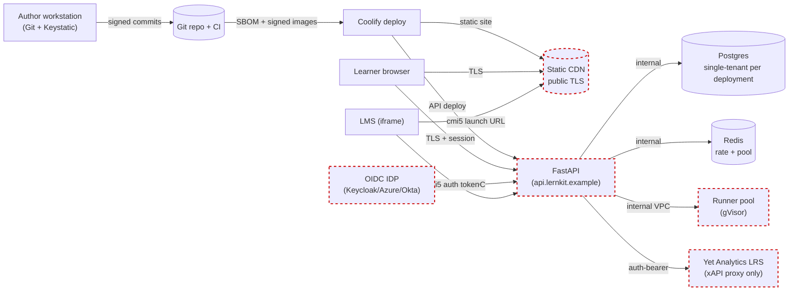

# 05 — Security Model

> Trust boundaries, STRIDE analysis, sandbox hardening, secret inventory, dependency governance, incident response, and credit-only disclosure program. Cross-references [`00-quality-attribute-goals.md`](./00-quality-attribute-goals.md) §4, [`04-risk-register.md`](./04-risk-register.md) R-03, R-07, R-19, and ADR 0008.

> **Scope narrowed 2026-04-21 per [ADR 0022](../adr/0022-oss-single-tenant-framework-scope.md).** Enterprise pen-test cadence and monetary bug-bounty program are dropped; security rotation stays shared across BE-1 + Many with ad-hoc external engagements (e.g. scorm-again license audit at P0, sandbox review at P3 end). Multi-tenant STRIDE table is removed — the substrate is single-tenant (one org per deployment) per [ADR 0022](../adr/0022-oss-single-tenant-framework-scope.md), which substantially reduces the authorization-layer surface. Sandbox hardening and dependency governance sections are unchanged: those threats do not depend on tenancy. Operational posture follows [ADR 0021](../adr/0021-self-host-first-infrastructure-principle.md).

## 1. Trust boundaries per DDD context

Trust boundaries are drawn where data crosses an authentication or authorization domain. The seven shown correspond to the contexts in [`../ddd/00-strategic-overview.md`](../ddd/00-strategic-overview.md).

Each dashed node marks a trust boundary. Key rules:

- The browser **never** holds LRS credentials — all xAPI traffic goes via `/xapi` proxy (Research §4.5).
- The FastAPI API **never** embeds runner-host credentials in responses — runner orchestration happens server-side via service-account tokens short-lived to ≤ 15 min.
- The runner pool is on a **separate VPC segment** from app servers; egress is whitelisted or blocked by default (`network=none` in ADR 0008).
- The LMS iframe origin is explicitly enumerated in CSP `frame-ancestors`; wildcards rejected.

> **Single-tenant substrate note (added 2026-04-21 per [ADR 0022](../adr/0022-oss-single-tenant-framework-scope.md)).** One Lernkit deployment serves one organization. The Postgres + Redis + LRS trio is scoped to that one org; there is no cross-tenant boundary to defend. This substantially reduces the authorization-layer risk that a multi-tenant framework would have to solve (RLS correctness, schema-per-tenant isolation, cross-tenant data-leak test harnesses). This is a **deliberate product decision**, not a to-be-fixed gap. Operators running multiple Lernkit deployments run them as separate installations on separate substrates — we do not validate against a shared-substrate multi-tenant pattern.

## 2. STRIDE analysis — two highest-risk contexts

> Reduced from three to two on 2026-04-21 per [ADR 0022](../adr/0022-oss-single-tenant-framework-scope.md): the *Identity & Tenancy* STRIDE table is removed because the substrate is single-tenant. *Code Execution* and *LMS Launch / LRS Gateway* remain high-risk contexts regardless of tenancy and are retained as-is.

### 2.1 Code Execution

| Threat (STRIDE) | Vector | Mitigation | Residual risk |
|---|---|---|---|
| **S** Spoofing | A learner's signed session token replayed by a third party to exhaust their quota. | Session tokens bound to user ID + IP + UA-family; short TTL (15 min) with refresh; Redis dedup on recent tokens. | L — replay within UA-family possible. |
| **T** Tampering | Learner submits code that edits container image layers (if misconfigured). | Read-only root FS (`--read-only`), tmpfs-only writable (`/tmp:size=64m,noexec`); immutable image pull-by-digest. | L — hardened per ADR 0008. |
| **R** Repudiation | Learner claims they didn't submit malicious code. | Every `/exec` call logged with source-hash, user ID, runner ID, duration; immutable audit log for 90 days. | L. |
| **I** Information disclosure | Code reads runner env vars (`printenv`); code egresses to attacker server. | No secret env vars in runner (`env -i` equivalent); `--network=none` default; whitelisted egress only for `<RunnableRF>` advanced. | M — advanced RF lessons see risk R-07. |
| **D** Denial of service | Fork bombs, infinite loops, memory overcommit. | Per-container `--pids-limit=64 --memory=256m --cpus=0.5`; orchestrator wall-clock timeout (never trust in-container); per-user Redis quota; CPU anomaly detection alerts. | L — bounded blast. |
| **E** Elevation of privilege | Sandbox escape via kernel exploit. | gVisor runsc user-space kernel; `cap-drop=ALL`; `no-new-privileges`; seccomp profile whitelist; Firecracker documented as a self-host opt-in per ADR 0008 for abuse-prone deployments (language narrowed 2026-04-21 per [ADR 0022](../adr/0022-oss-single-tenant-framework-scope.md); no multi-tenant framing). | M — kernel exploits in gVisor have precedent; quarterly red-team (per [`03-test-strategy.md`](./03-test-strategy.md) §10); Firecracker upgrade path documented. |

### 2.2 LMS Launch / LRS Gateway

| Threat | Vector | Mitigation | Residual risk |
|---|---|---|---|
| **S** Spoofing | Attacker launches Lernkit content with forged cmi5 launch token to impersonate a learner. | cmi5 launch tokens issued by LMS; Lernkit validates signature + short TTL + single-use nonce stored in Redis. | L. |
| **T** Tampering | LMS-sent launch parameters tampered in transit. | All launches over HTTPS; parameter integrity by HMAC when IDP supports it; reject unsigned launches from unknown LMSes. | L. |
| **R** Repudiation | Learner disputes completion; we lack proof of statements emitted. | Immutable LRS write log; statement voiding uses ADL voided-statement pattern, not delete. | L. |
| **I** Information disclosure | xAPI statements contain PII (actor IFI); LRS dump leaks. | Default pseudonymize actor IFI (SHA-256 + per-deployment salt); at-rest encryption on Postgres data dir. *Per-tenant schema language removed 2026-04-21 per [ADR 0022](../adr/0022-oss-single-tenant-framework-scope.md): one LRS per deployment.* | M — actor IFI may still identify in small cohorts; GDPR DPIA required for the deployment. |
| **D** Denial of service | Statement flood from a misbehaving content to the LRS. | xAPI proxy enforces per-session statement rate limit (default 60 req/min); batch endpoint preferred; client-side debounce. | L. |
| **E** Elevation of privilege | Leaked LRS API key grants deployment-wide read/write. | Proxy only has LRS credentials; browser never sees them; LRS keys rotated every 90 days. | L. |

### 2.3 Identity & Tenancy

> **Removed 2026-04-21 per [ADR 0022](../adr/0022-oss-single-tenant-framework-scope.md).** The substrate is single-tenant; multi-tenant threat vectors (cross-tenant reads via broken RLS, malicious-tenant DoS across shared resources, tenant-admin repudiation) do not apply. The residual single-tenant authentication risks (session-fixation at OIDC redirect, JWT claim tampering, "learner" → "author" escalation) are handled by the WS-M single-tenant OIDC adapter using standard OIDC Core + PKCE defaults and route-level role checks; they are not a high-risk context in the scope-narrowed product shape and are tracked under the OIDC-adapter risk row R-22 in [`04-risk-register.md`](./04-risk-register.md) rather than a dedicated STRIDE table.

## 3. Sandbox hardening checklist (mirror of ADR 0008 and Research §4.3)

Every runner container must satisfy:

- [ ] `--runtime=runsc` (gVisor user-space kernel).
- [ ] `--network=none` unless the lesson explicitly needs network (advanced RF only, whitelisted egress).
- [ ] `--read-only` root filesystem.
- [ ] `--tmpfs /tmp:rw,size=64m,noexec` (writable scratch, no execution).
- [ ] `--memory=256m` (default; per-language overrides possible).
- [ ] `--cpus=0.5`.
- [ ] `--pids-limit=64`.
- [ ] `--cap-drop=ALL`.
- [ ] `--security-opt=no-new-privileges`.
- [ ] `--security-opt seccomp=runner.json` (custom profile, `runner.json` stored in repo, reviewed quarterly).
- [ ] Wall-clock timeout enforced at orchestrator, not in-container. Default 30 s.
- [ ] Output byte cap 1 MB; truncate + kill on exceed.
- [ ] Non-root user inside container (`USER lernkit` in Dockerfile; UID ≥ 1000).
- [ ] Pool refill from a golden image; destroy container after every job.
- [ ] Image scan with Trivy + Grype in CI; fail build on Critical/High CVE.
- [ ] Per-user per-day execution quota enforced in Redis **before** container start.
- [ ] Path-traversal validation on all file inputs to the runner.
- [ ] Image signed with cosign; runtime verification required (Kyverno or admission controller in k8s, script-level verify in Coolify).

**Verification.** Integration tests ([`03-test-strategy.md`](./03-test-strategy.md) §2) assert every checklist item by launching a runner and inspecting its `docker inspect` output. New runner image PRs block merge if any assertion fails.

## 4. Secret inventory and rotation policy

| Secret | Location | Rotation | Owner | Exposure if leaked |
|---|---|---|---|---|
| SCORM Cloud API token | GitHub Actions encrypted secret | 90 days | FE-2 | Other projects' SCORM Cloud sandbox (low) |
| LRS API key (per deployment) | FastAPI env (SOPS+age in repo, decrypted at deploy per [ADR 0021](../adr/0021-self-host-first-infrastructure-principle.md)) | 90 days | BE-1 | Full LRS write for that deployment (high) |
| OIDC client secret (single IdP per deployment) | FastAPI env (SOPS+age) | 180 days or on suspected compromise | BE-1 | IdP impersonation (high) |
| GitHub App secrets (Keystatic) | Keystatic config | 180 days | FE-1 | PR-based content tampering (medium) |
| Database password (Postgres) | FastAPI env (SOPS+age) | 180 days or on suspected compromise | BE-1 | Full data read/write (critical) |
| Redis password | FastAPI env (SOPS+age) | 180 days | BE-1 | Quota bypass, session tamper (high) |
| cosign keyless (Sigstore OIDC) | ephemeral per-release | per release | BE-1 | No long-lived secret to rotate |
| gitleaks allowlist regex | repo (plaintext) | N/A | FE-1 | False negatives allow real leaks |

> Secret rows removed 2026-04-21 per [ADR 0022](../adr/0022-oss-single-tenant-framework-scope.md): Stripe API key (billing out of scope); per-tenant LRS key variant (replaced by per-deployment key — single-tenant substrate).

**Operational rules.**

- No secret ever committed to the repo; gitleaks is the last-line defense.
- Secrets injected via environment from the Coolify secret store (SOPS+age in repo, decrypted at deploy — per [ADR 0021](../adr/0021-self-host-first-infrastructure-principle.md)); `.env` files in repo are `.env.example` only.
- Rotation drill quarterly: BE-1 + Many rotate one secret under controlled conditions and verify service continuity. *SEC-owned drill removed 2026-04-21 per [ADR 0022](../adr/0022-oss-single-tenant-framework-scope.md); no dedicated SEC hire.*

## 5. Dependency governance

### 5.1 License allow-list (per ADR 0014)

Auto-approved:

- MIT, Apache 2.0, BSD-2-Clause, BSD-3-Clause, ISC, MPL 2.0, CC0.

Requires review before adoption (license-checker fails CI with `review-needed` tag):

- LGPL-2.1, LGPL-3.0, EPL-2.0, CDDL.

Rejected by default:

- **GPL-2.0, GPL-3.0, AGPL-3.0, SSPL** — not permitted in the Lernkit core.
- **Commercial, proprietary, source-available non-OSS** — permitted only as opt-in enterprise integrations (WebContainers, PrinceXML, Rustici Engine).

Known exceptions (GPL-adjacent reference, not linked):

- Adapt Framework (GPL v2) — **read-only reference for SCORM Spoor extension**, not vendored. Research §1.2.
- H5P (MIT core, some types GPL) — embedded via `h5p-standalone` (MIT), which renders `.h5p` packages client-side; host framework is MIT. Research §1.2, §6.10.
- Judge0 (GPL v3) — HTTP call only, no linking. Legal review before enabling (Research §4.3).

### 5.2 SBOM (CycloneDX 1.5)

Generated per release via `syft` and published as a release artifact. Consumed downstream by:

- Trivy for vulnerability scanning (continuous).
- License-checker for license drift (CI gate).
- Customer-facing transparency (published at `https://lernkit.example/sbom/<version>.cdx.json`).

### 5.3 Supply-chain posture

- **Lockfiles** (`pnpm-lock.yaml`, `poetry.lock`) reviewed on every PR; manual audit by a human reviewer, not just CI, for lockfile-only PRs.
- **`pnpm audit signatures`** + **`pip-audit`** on every PR.
- **Renovate bot** enabled for dependency updates; tuned to:
  - Auto-merge patch + non-breaking minor for allow-listed licenses only.
  - Hold major upgrades for human review.
  - Fail PR if license drifts.
- **cosign** signs release container images (Sigstore keyless). Coolify deploy verifies signature before pull.

### 5.4 Vendor policy for single-maintainer critical deps

Per ADR 0014, the following deps have a **single-maintainer risk** (risk R-09) and require enhanced governance:

- **scorm-again** — vendor source into `vendor/scorm-again/`, pin exact version, contribute upstream via PR, maintain a local fallback implementation for P3+.
- **simple-scorm-packager** — vendor source; it has not shipped in 4 years and is effectively dead-code-we-own.
- **Keystatic** — not vendored (too large), but Sveltia CMS fallback ready (ADR 0011); version pinned; internal fork ready to branch if needed.

## 6. Incident response playbook (outline)

Stages: **detect → contain → eradicate → recover → learn**.

- **Detect (SLO < 15 min).** Alerts fire from [`06-observability-plan.md`](./06-observability-plan.md) into email + Mattermost webhooks (self-host-first 2026-04-21 per [ADR 0021](../adr/0021-self-host-first-infrastructure-principle.md); PagerDuty dropped). On-call acknowledges within 5 min during business hours, best-effort off-hours (scope narrowed 2026-04-21 per [ADR 0022](../adr/0022-oss-single-tenant-framework-scope.md); no enterprise-SLA commitment).
- **Contain (SLO < 60 min).** Known containment actions:
  - Kill runner pool; drain queue; scale to zero.
  - Rotate affected secret (per §4 inventory).
  - Disable affected feature flag (CSP, `/exec`, `/xapi`, `/login`).
  - Isolate runner host from main VPC.
- **Eradicate (SLO < 24 h).** Patch vulnerability; deploy fix; re-scan; document root cause.
- **Recover.** Restore full service; communicate to affected operators and their learners.
- **Learn.** Post-mortem within 5 business days; published to `docs/security/postmortems/` with timeline + root cause + five whys + action items with owners.

Runbook stubs (to be filled during P3):

- `runbooks/sandbox-escape.md`
- `runbooks/lrs-credential-leak.md`
- `runbooks/scorm-cloud-outage.md`
- `runbooks/dependency-cve.md`
- `runbooks/oidc-misconfiguration.md`

> `runbooks/tenant-data-leak.md` removed 2026-04-21 per [ADR 0022](../adr/0022-oss-single-tenant-framework-scope.md); no multi-tenant substrate. Replaced with `runbooks/oidc-misconfiguration.md` for the single-tenant-adapter failure mode.

## 7. Disclosure policy and security-review cadence

> **Simplified 2026-04-21 per [ADR 0022](../adr/0022-oss-single-tenant-framework-scope.md).** Enterprise pen-test cadence and monetary bug-bounty program are dropped. Replaced with a **sandbox-focused threat-modeling + dependency scanning + credit-only disclosure program** via `SECURITY.md` and GitHub Security Advisories.

### 7.1 Credit-only disclosure program (active from P1, publicly active at P5)

- `SECURITY.md` at repo root with a clear contact (email + PGP key). Reports via email or a private GitHub Security Advisory.
- Response SLO: **acknowledge < 48 h, triage < 5 business days, resolve < 90 days** (target; not an enterprise SLA).
- **Credit-only, no cash payout.** Valid reporters get CVE credit in the CHANGELOG and security advisory.
- Safe harbor language in `SECURITY.md`: researchers acting in good faith per the documented scope are not prosecuted.
- Scope: `/exec` sandbox, LMS-launch flows, OIDC adapter, packager output integrity, build-pipeline supply chain.
- Out of scope: marketing site, third-party integrations, known acceptable risks (documented in `SECURITY.md`).

### 7.2 Security-review cadence (sandbox-focused)

- **Ongoing dependency scanning.** Trivy + Grype on images, `pnpm audit signatures`, `pip-audit`, Renovate for updates (see §5). These are the continuous-signal floor.
- **Targeted external engagements (ad hoc, not a recurring SLA).** Engaged when the surface changes materially:
  - **P0:** scorm-again license audit (one-off legal/licensing review, not a pen-test).
  - **P3 end:** sandbox-focused external review — the `/exec` runner, gVisor configuration, seccomp profile, resource limits. Two-week engagement. Replaces what was previously labelled a "pen-test" in the enterprise-scope plan.
  - **Post-P5, ad hoc:** further reviews triggered by material surface changes (new runner language, new LMS-launch path, dependency-replacement risks).
- Vendor selection owned by Many (BE-1 consulted); two bids minimum; vendor rotated if the surface under review changes materially.

### 7.3 Threat-modeling cadence

- STRIDE review per §2 refreshed at each phase gate for *Code Execution* and *LMS Launch / LRS Gateway*.
- Quarterly red-team tabletop per [`03-test-strategy.md`](./03-test-strategy.md) §10, focused on sandbox-escape scenarios.

> Removed 2026-04-21 per [ADR 0022](../adr/0022-oss-single-tenant-framework-scope.md): the recurring enterprise-scale pen-test cadence (P3 + P5 enterprise-scope), the HackerOne/Intigriti monetary bug-bounty program, the $50k/yr bounty budget line.

## 8. Privacy and GDPR posture

Tied to risk R-19.

- **Actor IFI pseudonymization** on by default in LRS (SHA-256 + per-deployment salt). Opt-out is a deployment-level config.
- **Right to erasure:** DSAR procedure documented at `docs/privacy/dsar.md` — deployment admin can delete a learner's statements; voided-statement pattern retains audit but removes PII.
- **Data retention:** raw xAPI statements retained 365 days by default (configurable per deployment); aggregates retained indefinitely.
- **Cross-border transfer:** self-hosted by default per [ADR 0021](../adr/0021-self-host-first-infrastructure-principle.md); operators running in the EU deploy to EU-region Coolify targets. *Scope narrowed 2026-04-21 per [ADR 0022](../adr/0022-oss-single-tenant-framework-scope.md): we do not provide a managed EU-region LRS.*
- **DPA template** published at `docs/privacy/dpa-template.md` for operators who need it with their own downstream customers; Lernkit itself is not a processor (we ship software, not a service). *Previous "required for every paying enterprise customer" language removed 2026-04-21 per [ADR 0022](../adr/0022-oss-single-tenant-framework-scope.md).*

## 9. Training and culture

- Security onboarding for every engineer: 2-hour course + quiz on this document + ADR 0008 + OWASP Top 10 2021.
- Quarterly red-team tabletop (per [`03-test-strategy.md`](./03-test-strategy.md) §10).
- Every ADR touching a trust boundary requires Many + BE-1 pair-signoff (the shared security rotation — scope narrowed 2026-04-21 per [ADR 0022](../adr/0022-oss-single-tenant-framework-scope.md); no dedicated SEC hire).
