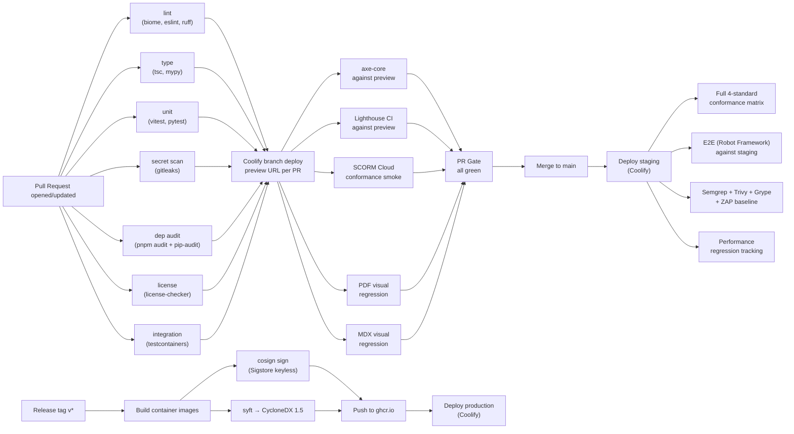

# 07 — CI/CD Pipeline

> Concrete GitHub Actions pipeline design. PR checks, merge-to-main actions, release workflow, preview environments, and supply-chain posture. Cross-references [`03-test-strategy.md`](./03-test-strategy.md), [`05-security-model.md`](./05-security-model.md), [`09-dependency-governance.md`](./09-dependency-governance.md), [`PRODUCT-SHAPE.md`](./PRODUCT-SHAPE.md), ADR 0014, ADR 0018, ADR 0021, ADR 0022.

> **Self-host-first 2026-04-21 per [ADR 0021](../adr/0021-self-host-first-infrastructure-principle.md).** GitHub (source, issues, Actions, GHCR) is an explicit self-host-first exception. Every other CI dependency is self-hosted on the Coolify box. CI runner default is **GitHub-hosted `ubuntu-latest`**; self-hosted runners are gated to specific jobs (see §10).

## 1. Pipeline topology



## 2. PR checks (required to merge)

Every PR to `main` triggers `.github/workflows/pr.yml` which runs the jobs below in parallel where possible. Total wall-clock target: **< 20 min** ([`03-test-strategy.md`](./03-test-strategy.md) per-stage budgets).

### 2.1 Fast gates (parallel, 1 min each)

- **lint-js** — biome check on `**/*.{ts,tsx,js,jsx,mjs,cjs,json,md,mdx}`, eslint for a11y rules on React islands.
- **lint-py** — ruff check + ruff format --check on `apps/api/**/*.py`.
- **type-js** — `pnpm -r tsc --noEmit`.
- **type-py** — `poetry run mypy apps/api`.
- **secret-scan** — `gitleaks detect --source . --log-opts="HEAD~5..HEAD"` (diff-only to keep fast).

Any failure blocks the PR; no override.

### 2.2 Dep audit + license gate (parallel, 2 min)

- **dep-audit** — `pnpm audit --audit-level=high` and `poetry run pip-audit`.
- **license-check** — `license-checker --production --onlyAllow "<allow-list>"` per ADR 0014 / [`09-dependency-governance.md`](./09-dependency-governance.md). License-checker allowlist lives in `ci/license-allowlist.json`. Fails on any license outside the allow-list.
- **npm-audit-signatures** — `pnpm audit signatures` verifies npm registry signatures on all production deps.
- **infra-self-host-policy** (Self-host-first 2026-04-21 per ADR 0021) — policy-as-code check that every infrastructure dependency listed in the [`09-dependency-governance.md`](./09-dependency-governance.md) service table is either marked **self-hosted** or carries an **exception** paragraph per ADR 0021 §Policy. A PR that introduces a new SaaS row without an exception paragraph fails this gate.

### 2.3 Unit + integration (sequential per package, parallel across packages, ~5 min)

- **unit-vitest** — `pnpm -r vitest run --coverage`; fails if coverage on `@lernkit/packagers` or `@lernkit/tracker` drops below 80%.
- **unit-pytest** — `poetry run pytest --cov=app --cov-report=xml`; fails at < 70% overall / < 80% on tracker and packagers Python side.
- **integration-backend** — Testcontainers-backed tests for FastAPI + Postgres + Redis + (from P3) real gVisor runner. Runs on `runs-on: ubuntu-latest` for the Postgres/Redis portion; the gVisor portion from P3 onward runs on a self-hosted runner because it needs bare-metal / `--privileged` access (Self-host-first 2026-04-21 per ADR 0021 — self-hosted justified under rule (b) "bare-metal need"). See §10.

### 2.4 Preview deploy (3 min)

- **preview-deploy** — Coolify webhook creates a branch-specific preview at `pr-<number>.lernkit.example`. Deploy SLO < 8 min end-to-end; the 3-min budget here is for workflow orchestration only, actual deploy runs async.

The subsequent jobs wait for `preview-deploy` to signal ready via a status check on the PR.

### 2.5 Post-preview gates (parallel, 5–10 min)

- **axe-core** — `@axe-core/playwright` run against preview URL for each route in the sample course; fails on any Critical or Serious finding. Baseline findings documented as known issues in `docs/a11y/known-issues.md`.
- **lighthouse-ci** — `lhci autorun` against preview URL; fails on budget breach per [`00-quality-attribute-goals.md`](./00-quality-attribute-goals.md) §3. Budgets defined in `lighthouserc.json`.
- **scorm-cloud-smoke** — packages the sample course as SCORM 1.2 (P1+) and cmi5 (P3+), uploads to SCORM Cloud via REST API, launches scripted learner session, verifies completion + score. Fails if SCORM Cloud rejects the package or returns wrong completion state.
- **pdf-visual-regression** — builds sample PDF via Paged.js + Playwright; compares against baseline; fails on > 0.1% pixel diff.
- **mdx-visual-regression** — per-story page screenshots (light + dark, desktop + mobile); same 0.1% threshold.

### 2.6 Aggregate PR gate

A final `pr-gate` job depends on all above. Only `pr-gate` is marked **required** in branch protection, so GitHub surfaces one clean status. Merge blocked unless `pr-gate` is green.

## 3. Merge to main

`.github/workflows/main.yml` triggers on push to `main`.

### 3.1 Deploy staging (first, 8 min budget)

- **deploy-staging** — Coolify deploys the commit to `staging.lernkit.example`.
- Health check: `curl` `/healthz` + `/readyz` on the new revision.

### 3.2 Full conformance matrix (parallel, 8 min — four 2-min runs)

- **conformance-scorm12**, **conformance-scorm2004**, **conformance-cmi5**, **conformance-xapi** — each packages, uploads, launches, and verifies in SCORM Cloud. Content-hash caching avoids redundant uploads (risk R-15 mitigation).
- Red on any standard opens a release-blocker ticket via `gh issue create`.

### 3.3 E2E (Robot Framework, 20 min budget)

- **e2e-rf** — `tests/e2e/*.robot` run against staging via `robotframework-browser`. Top-level journeys: author → learner → packaging → LMS launch → dashboard.
- Flake tolerance: one retry on transient network or browser start failure; second failure opens a ticket.

### 3.4 Security scans (10 min)

- **semgrep** — `p/security-audit`, `p/python`, `p/javascript`, plus a Lernkit-specific ruleset at `ci/semgrep/lernkit.yml` for our own anti-patterns (e.g. `// no direct scorm-again import in components/` → must go through `@lernkit/tracker`).
- **trivy** — `trivy fs` on repo + `trivy image` on built containers.
- **grype** — `grype` on built containers (second opinion to Trivy).
- **zap-baseline** — ZAP baseline scan against staging (weekly cadence owned by the `zap.yml` scheduled workflow, not per-merge).

### 3.5 Performance regression tracking (5 min)

- **perf-track** — Lighthouse against staging with results posted to Grafana via OTel metric exporter; compared against 7-day rolling baseline; alert on > 5% regression per metric.
- **k6-nightly** (scheduled, not per-merge) — 100-concurrent `/exec` load test.

## 4. Release workflow

`.github/workflows/release.yml` triggers on `git tag v*`.

### 4.1 Build

- **build-containers** — multi-arch (linux/amd64, linux/arm64) builds for `api`, `site`, `runner-python`, `runner-node`, `runner-rf`.
- **bundle-artifacts** — CLI tarball, SBOM, release notes from CHANGELOG.

### 4.2 Sign + SBOM

- **cosign-sign** — Sigstore keyless signing via GitHub OIDC. No long-lived keys to manage. Signature stored as a cosign signature artifact in `ghcr.io`.
- **syft-sbom** — `syft <image> -o cyclonedx-json@1.5` produces the SBOM. Attached to the image via `cosign attest --predicate sbom.json --type cyclonedx`.

### 4.3 Publish

- **ghcr-publish** — push signed + SBOM-attested images to `ghcr.io/lernkit/*`.
- **release-artifacts-upload** — attach CLI tarball, SBOM, release notes to the GitHub Release.

### 4.4 Deploy production

- **deploy-prod** — Coolify production deploy. Coolify verifies cosign signature before pull (via a pre-deploy hook that runs `cosign verify`). If verification fails, deploy aborts and on-call paged.
- **post-deploy-smoke** — curl `/healthz`, `/readyz`, `/version`; abort and rollback if any fail.
- **changelog-publish** — update `https://lernkit.example/changelog` from `CHANGELOG.md`.

## 5. Preview environments

- **Trigger:** every PR to `main`.
- **Mechanism:** Coolify branch deploy via webhook from `pull_request.opened`, `pull_request.synchronize`, `pull_request.reopened`.
- **URL:** `pr-<number>.lernkit.example`.
- **TTL:** torn down on PR close/merge.
- **Data:** per-PR isolated Postgres schema seeded from a fixture dump; no real production data ever.
- **Access:** public URL by default; can be protected with HTTP basic auth via PR label `preview:protected`.

## 6. Renovate configuration (dep updates)

`renovate.json` config highlights:

- **Schedule:** weekly at Sunday 02:00 UTC.
- **Auto-merge:** enabled for:
  - Patch updates of MIT / Apache-2.0 / BSD / ISC / MPL-2.0 deps.
  - Non-breaking minor updates of above.
  - No auto-merge for: majors, any license not on allow-list, Astro / Starlight / MDX / Pyodide / scorm-again (explicit manual-review list).
- **Package rules:**
  - `astro` + `@astrojs/starlight` — minor updates grouped, manual review, 7-day merge freeze after release.
  - `pyodide` — all updates manual review (per risk R-13).
  - `@anthropic-ai/sdk` or similar AI SDKs — manual review (P4+).
  - `scorm-again`, `simple-scorm-packager`, `keystatic` — per ADR 0014 vendored; Renovate notifies only.
- **Stability days:** 3 days default; 14 days for majors.

## 7. Workflow file layout

```
.github/workflows/
├── pr.yml                 # parallel PR checks (§2)
├── main.yml               # post-merge: staging, matrix, E2E, scans (§3)
├── release.yml            # tagged release: build, sign, publish (§4)
├── zap.yml                # weekly ZAP baseline
├── k6.yml                 # nightly load test
├── lms-smoke.yml          # nightly LMS compatibility smoke (P3+)
├── renovate.yml           # Renovate self-hosted runner scheduling
└── dependabot.yml         # fallback for Renovate outages
```

## 8. Secrets used in CI

Per [`05-security-model.md`](./05-security-model.md) §4 secret inventory:

- `SCORM_CLOUD_API_TOKEN` — used in conformance jobs; rotated 90 days.
- `COOLIFY_DEPLOY_TOKEN` — used in deploy jobs; rotated 90 days.
- `GLITCHTIP_AUTH_TOKEN` — release-notification job against the self-hosted GlitchTip instance (Self-host-first 2026-04-21 per ADR 0021; replaces prior `SENTRY_AUTH_TOKEN` reference).
- `GITHUB_TOKEN` — scoped per workflow via `permissions:` block; minimum necessary.
- `NPM_AUTH_TOKEN` — if publishing packages to npm; scoped to org.
- `SIGSTORE_OIDC` — ephemeral, per-run (keyless cosign).

None of these appear in workflow logs; `set -u` and masked-echoes enforced.

## 9. Required branch protections on `main`

- `pr-gate` required.
- At least **1 review** required; code owners auto-requested.
- Dismiss stale reviews on new commit.
- Require signed commits (P5+; optional before).
- Require linear history (no merge commits; rebase or squash only).
- Require status checks to pass before merging.
- Do not allow bypass for anyone (including admins) once a PR is ready.

## 10. GitHub Actions runner policy

**Self-host-first 2026-04-21 per [ADR 0021](../adr/0021-self-host-first-infrastructure-principle.md).**

**Default: `runs-on: ubuntu-latest` (GitHub-hosted).** Every job in this pipeline is `runs-on: ubuntu-latest` unless it falls into one of the named exceptions below. GitHub-hosted runners are free for public repos, have no self-host security surface, and align with the GitHub exception in ADR 0021. Jobs running against a **PR from a fork** are **always** GitHub-hosted — self-hosted runners are never exposed to untrusted fork PRs.

### 10.1 Decision rule for self-hosted runners

A job is permitted to run on a self-hosted runner only when one of the following is true and documented on the job:

- **(a) Cost.** The GitHub-hosted runner cost for this job materially exceeds budget. (Unlikely at project size; revisit quarterly.)
- **(b) Bare-metal need.** The job needs capabilities GitHub-hosted runners cannot provide — e.g. gVisor / KVM benchmarks, nested virtualization, `--privileged` Docker without the GitHub restrictions.
- **(c) Sandbox-runner isolation.** The job runs untrusted learner code as part of the sandbox runner's own test suite and requires isolation characteristics GitHub's shared runners cannot guarantee.

When adopted, self-hosted runners are **ephemeral, single-use** containers behind a job-level allow-list; they are torn down after every job; they are never exposed to PRs from untrusted forks. They run on a dedicated Hetzner box per [ADR 0018](../adr/0018-coolify-on-hetzner-for-self-hosting-default.md), registered via `actions-runner-controller` or equivalent.

### 10.2 Named self-hosted exceptions (justified)

| Job | Rule | Justification |
|---|---|---|
| `integration-backend` (gVisor portion, from P3) | (b) bare-metal | Needs `--privileged` + gVisor runsc; cannot run on GitHub-hosted. |
| `sandbox-gvisor-bench` (P3+) | (b) bare-metal | gVisor + KVM benchmarks require real hardware counters. |
| `sandbox-runner-self-tests` | (c) isolation | The sandbox's own test suite runs adversarial learner code. |

### 10.3 Default (hosted) for everything else

The jobs below **stay on `ubuntu-latest`** even though an earlier draft suggested self-hosting:

- **e2e-rf** — GitHub-hosted Ubuntu with the standard Playwright browser stack is sufficient. (Real-browser test matrix at scale runs fine on hosted.)
- **k6-nightly** — GitHub-hosted has adequate network egress for our 100-concurrent profile; revisit only if rule (a) is hit.
- **axe-core**, **lighthouse-ci**, **scorm-cloud-smoke**, **pdf-visual-regression**, **mdx-visual-regression** — all `runs-on: ubuntu-latest`.
- **conformance-scorm12 / 2004 / cmi5 / xapi** — all `runs-on: ubuntu-latest`.
- **semgrep / trivy / grype / zap-baseline** — all `runs-on: ubuntu-latest`.

## 11. Observability of the pipeline itself

- OTel traces emitted from each workflow via the `otel-github-actions-exporter`.
- Pipeline dashboard in Grafana: PR wall-clock trend, flake rate per job, slow-job leaderboard.
- Alert: any job exceeds 2× its 7-day wall-clock p95 → ticket for investigation.

## 12. Rollout by phase

- **P0:** `pr.yml` with lint/type/unit/secret/audit/license; `main.yml` with staging deploy and basic tests; `release.yml` stub.
- **P1:** add Lighthouse CI, axe-core, SCORM Cloud smoke, PDF/MDX visual regression.
- **P2:** Service Worker verification tests; PDF visual regression to production baseline.
- **P3:** full four-standard conformance matrix; nightly LMS smoke; self-hosted runners **only for the named §10.2 exceptions** (gVisor bench + sandbox self-tests) per Self-host-first 2026-04-21 per ADR 0021; Semgrep + Trivy + Grype + ZAP weekly; cosign + syft in release.
- **P4:** preview environments gain LRS fixture; synthetic journey in staging.
- **P5:** cosign verify enforced at deploy; full nightly LMS conformance matrix (SCORM Cloud + Moodle + TalentLMS + Docebo + iSpring + SAP SuccessFactors for 2004) gates release; SLO reports auto-generated per sprint and published to the repo's `/status` page. (Scope narrowed 2026-04-21 per [ADR 0022](../adr/0022-oss-single-tenant-framework-scope.md); PagerDuty dropped per [ADR 0021](../adr/0021-self-host-first-infrastructure-principle.md).)
